# Nanmei Yumihari Hakkenden - The Eight Dog Bowmen At The Southern Sea

::: tip
[This summary translation is done by Petrikow on Beast Lair and assumes Traum Clear](https://forums.nrvnqsr.com/showthread.php/9288-FGO-JP-Event-The-Eight-Dog-Bowmen-at-the-Southern-Sea?p=3203665&viewfull=1#post3203665)
:::

## Prologue - The Shaggy Dog makes the Heroic Warriors Come Running

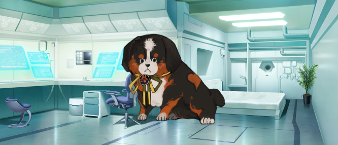

When you wake up, something is licking you. You suspect Fou, but it's a dog you've never seen before.

Barghest enters your room, carrying clothes that have undergone care from Miss Crane and Habetrot. She sees the dogs and wants to pet it, but it flees.

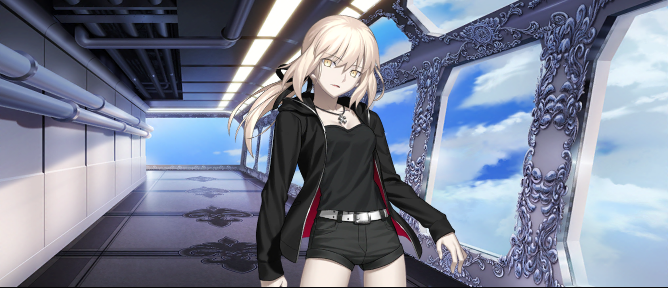

Elsewhere, the dog encounters Saber Alter who senses that its hungry and offers to give it some dog food she keeps around. She wants to name it 'Cavall the Third'.

Alexander happens upon the scene too, finding the puppy quite beautiful and calling it 'Pelitas'. He offers it some water, which it refuses.

Next Sei appears, calling it 'Okinamaru'. Not actually her dog though, but it does resemble the one she once had. She starts petting it to the others envy. Alexander notices it has a heart mark on its back.

Caren, Cu and Ko-Gil show up and observe too. Caren offers to pet Cu too, if only he gets down on his back and begs like a dog. Gil is a bit suspicious of the dog.

The puppy feels overwhelmed by the people trying to give it a name and escapes again.

It runs past Abigail, Bunyan and Carmilla, and even the scary Hessian Lobo.

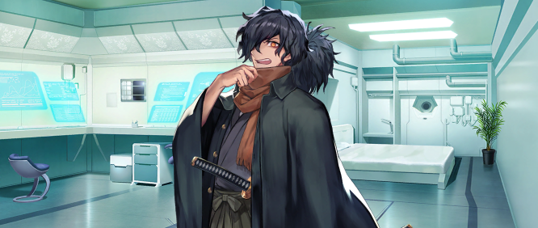

Eventually it takes shelter in Izou's room, crawling up next to him for shelter, much to his annoyance.

Abigail and Bunyan come in asking for it, but Izou plays dumb, hiding it in his clothes.

Next is Alexander, Sei and Saber Alter who ask much the same. Once again, Izou chases them off.

He talks a bit with the puppy, rationalizing that he only started hiding because others wanted to find it.

Eventually you enter Izou's room together with Hokusai and Barghest. Izou once again plays dumb, but Hokusai does a loud "boo!" and scares the puppy out.

An unknown female Servant emerges, calling the puppy Sousuke. This is the puppy's real owner.

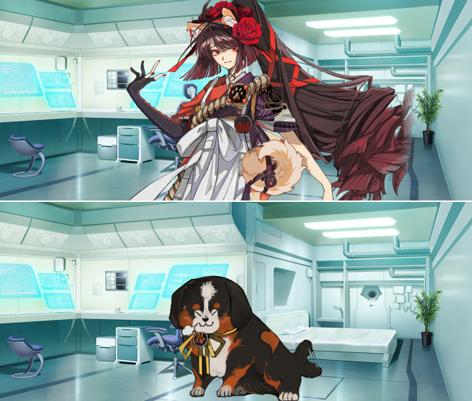

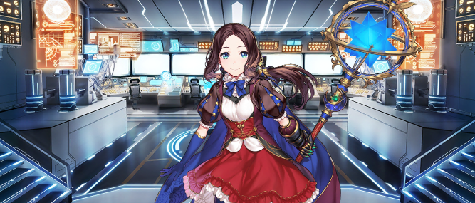

At the control room, Da Vinci explains the situation to Izou. The Servant is Kyokutei Bakin, Japan's first professional full-time writer. Bakin affirms, somewhat stammering the words out.

Mashu and the whole crew are impressed but... why a woman (again?) (for the xth time) (used to it now but) (maybe we're the ones who are strange?) (what are parallel worlds anyway?)

Regardless, Da Vinci confirms they didn't summon Bakin. She's a stray Servant who appeared on her own at the summoning circle. You're the one who first discovered her.

However, Sousuke the Bernese Mountain Dog showed up before Bakin did. According to Bakin, Sousuke is supposed to be her familiar but...

In any case, this led them to finding the puppy in Izou's room.

Izou thinks it sounds fishy. Familiars should be one with their masters. He's not gonna be so naive, this is clearly an assassination attempt! Bakin doesn't know what to say.

In some ways, Da Vinci agrees, it is odd. Barghest will have to accompany Bakin while they investigate her. But there's also Hokusai, who knows Bakin better than anyone else. What does she think?

Hokusai is strangely quiet, before loudly exclaiming this isn't Bakin at all, but his adopted daughter Omichi. Bakin shamefully admits as much.

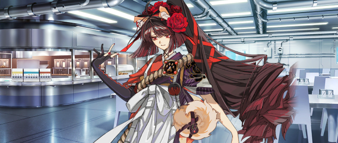

Barghest, you, Mashu and Bakin go to the Cafeteria. Bakin wants to thanks Izou for watching over Sousuke but he's gone off somewhere.

Mashu gets an analysis report from Da Vinci: Bakin is a Rider, has a physically female body, estimated physical age of 16-18, mentally sound. However, her Saint Graph is strangely paltry (in terms of magical energy). 1/8th of a normal servant.

Hokusai reasons this is why Bakin only has one of her 8 Dog Warriors with her. In Bakin's work Hakkenden, the 8 weren't literal dogs, but that seems to be the case now.

In any case, this appears to be why Bakin's consciousness is only that of Omichi, though the details are unknown. In any case her 'Bakin' personality is mostly missing. Bakin requests to be called Omichi from now on.

As they said, she's missing most of her Dog Warriors. Sousuke has the single pearl of a necklace bound to him that reads "duty". The other Dog Warriors have ones with other letters. Only when all these are combined will Bakin be complete.

Hokusei found Omichi's acting from before a bit amusing. Bakin sighs, but is at least relieved to have the familiar Oei around.

Mashu wonders why Omichi is in Bakin's place in the first place. Maybe something similar to Hokusai? Bakin is confused. Hokusai? Where? Oei reveals that her little squid is Hokusai, much to Bakin's surprise who just thought Oei was using her father's name.

In desperation, Bakin wonders if maybe then Bakin is inside of her little Sousuke and starts shaking it about, calling out for Bakin. Barghest feels like it should be impossible, since Omichi and Bakin aren't related for real, but...

Suddenly Sousuke starts glowing, and an alarm sounds. Someone is aiming to shot Storm Boarder down! Barghest and Mashu protect you from the impact.

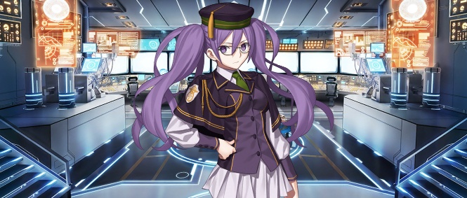

Afterward, Da Vinci reports the damages in the control room. They're back, but no staff have been lost or damaged.

Sion declares they've detected something like the large Singularity they just were at. In any case, they have to do something before it attacks again.

Ushiwakamaru and Kiichi Hougen show up to the meeting as well. Ushiwakamaru recognized the arrow: it was Genji. She detected it first, and reported it fast enough that they could get the barriers up. The first arrow is simply meant to adjust aim. The second is the real dangerous one.

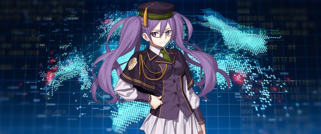

Sion brings up a map: it's a clustter of Micro-Singularities! The assailant is in one of them. The arrow went through space-time to attack them. Hokusai likens these Singularities to the "Nanmei", the ocean south of Japan, full of small islands.

Da Vinci has a plan though! She's already working on a certain part to deal with the next attack. She'll need help though.

In addition, they've detected 7 grails. The attacks won't stop at just two if they have that many resources. They'll need to find the assailant and stop them as fast as they can!

She'll leave that mission to you. Sion tells you to take Bakin with you. Omichi doesn't think she'll be of much help, but Sion insists. No time to explain why though.

All they can know is this: their enemy is Chinsei Hachirou Minamoto no Tametomo! The very same you met in the last Singularity. No doubt a very powerful Servant.

They'll give the rest of the information during the mission. Omichi still feels bad, but will try her best.

Mission start. They've named the Micro-Singularity Cluster as "Nanmei", after what Hokusai called it. Ushiwakamaru, Barghest, Hokusai and Bakin will accompany you.

Rayshift countdown commences, and Sousuke starts glowing. This resonates with Izou and Lobo, who are located elsewhere. Why does everything always go wrong at this step, moans Goredolf.

Sion reveals that they detected a Holy Grail from Sousuke as well, but faintly. Now what does that say about the Micro-Singularity Cluster? The Rayshift sequence continues regardless, as the same light engulfs all your Servants.

## Chaldea's 1st Bow - The Three Stellar Hunters Let Loose as Tremendous Arrows

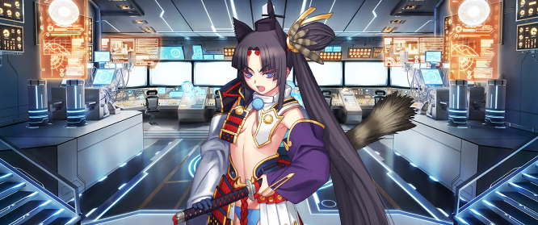

Ushiwakamaru is left behind in the aftermath of the Rayshift. Da Vinci and Mashu are busy with preparations and don't even notice her until she speaks up.

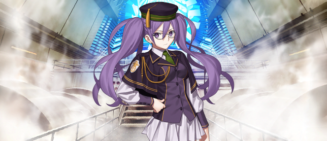

Feeling rather dejected, Ushiwakamaru goes to talk to Sion. Turns out Ushiwakamaru not going along wasn't the only problem. Izou and Lobo were taken to the Singularities as well.

Ushiwakamaru requests another Shift, but they can't. She'll have to stay behind and act as an informant about their enemy.

Atalante, Orion and Chiron show up, having been called there by Da Vinci.

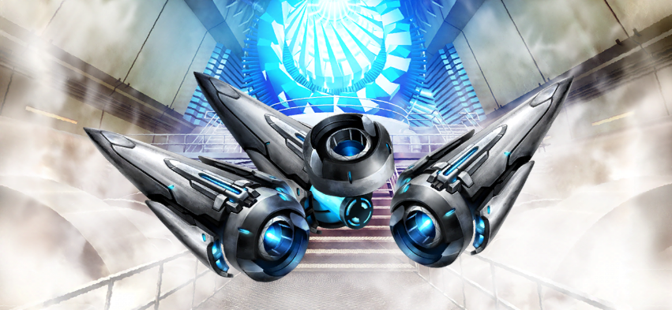

The new parts they developed are called "Saint Graph Pods". They can be installed on a Servant, storing their Saint Graph inside, and eject it like a shot. Easy to think of it like a simple Rayshift.

The Pod is shot onto a certain spacetime coordinate, manifest, fulfil their mission after which they are once again stored in the pod and returned to Chaldea.

However, only Archers can use them because of their "Independent Action" class skill. Otherwise the journey is too hard on a Servant. That's why the Greek Archers are there.

They agree it's a clever, if odd plan. Ushiwakamaru realizes once again that she's gonna be left out of the action and sulks.

Da Vinci orders the mission to start, who begin the Pod Launch Sequence. The three Archers are let loose!

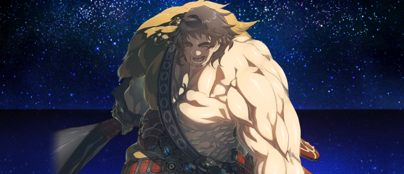

Orion beholds the strange cosmic view from inside his pod. It's simply a translation of what the sensors can pick up. He's currently in a chaotic spacetime state.

In any case, Da Vinci understands that the fact that Orion has manifested means that the second shot has already been detected.

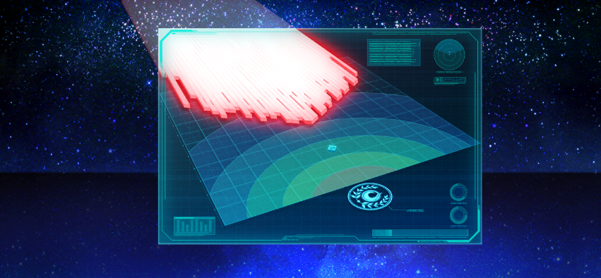

The detectors see a great wave of life, and Orion thinks its looks like boobies, much to Da Vinci's bewilderment. Kinda had that MILKY way vibe to it.

Regardless, Orion will deal with the attack and gets ready to fight. Da Vinci reminds him that he needs the Pod to return: defend it at all costs. Orion activates his Noble Phantasm.

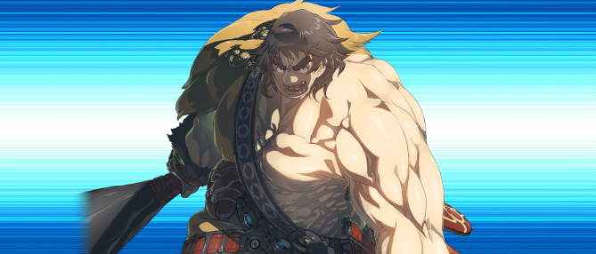

**==Battle against White Arrow Monsters==**

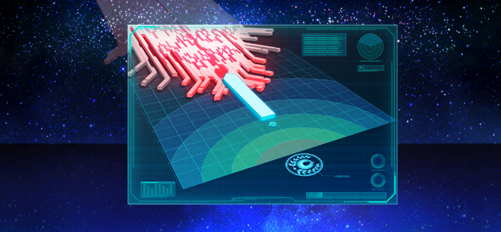

Orion runs out of magical energy and returns to his pod. His attacks all connected, and the wave of light appears to be diffracted, but it starts to reform regardless.

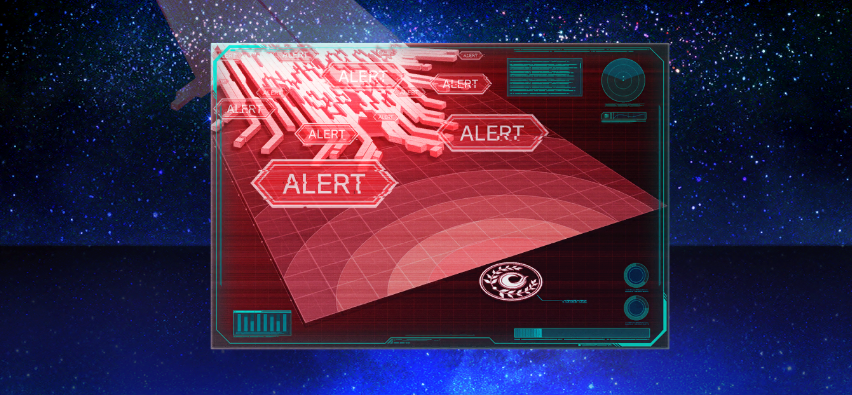

The command room bustles with activity, as they prepare to re-intercept the wave with all their other pods.

## Southern Expedition's 1st Arrow - Rowing Toward Nanmei to Identify the Enemy

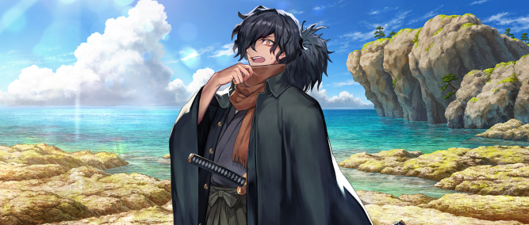

After the Rayshift, you find yourself together with the squad at a beach. Of course, Lobo and Izou are there for some reason too. Hokusai spots a familiar mountain in the distance.

Barghest quickly notices that Ushiwakamaru is gone. You hastily order Lobo to commence a search for her. You try connecting to Chaldea at Hokusai's advice, but fail. Not sure what happened, but something about Ushiwakamaru's Rayshift went wrong.

Barghest explains that though they can't establish full contact, Chaldea can detect their location through the Mystic Code you are wearing.

Lobo investigated the surrounding and found a small village, conveys Bakin. You are surprised to learn she can talk to the dog. She says its possible because of Sousuke.

Izou's distrust of Bakin is still present. In fact, isn't it likely Bakin is the cause of everything? Barghest says they should focus on the mission. Hokusai declares that if Bakin betrays them, she'll commit seppuku. See it as a way to keep the group from dissolving out of distrust.

You say you're not gonna let Hokusai do that, but you understand her feelings on the matter. Izou seems satisfied too, and apologizes. In any case, the mission awaits. Lobo starts leading you to the village.

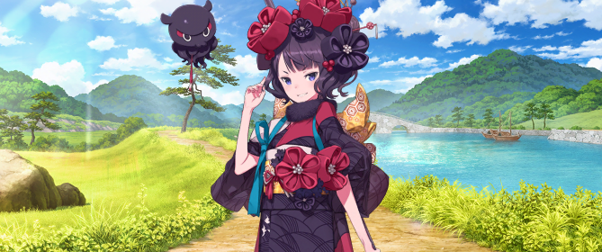

Hokusai reveals they're in Ryuukyuu, known these days as Okinawa. How can she tell? Well, obviously because Hokusai has painted this place! It's not exactly like the original though...

Barghest wonders if that means Hokusai is involved in the creation of the Singularities somehow, she is Foreigner-class after all... Hokusai feels like its a natural thing to ask but says she'll explain:

Bakin is involved, then Hokusai is involved, then Tametomo is involved. To understand she'll lecture on Tametomo too. He's Ushiwakamaru's uncle, and was exiled to Kyuushuu in youth. He subjugated the whole province, and gained the name of Chinzei (old name of Kyuushuu) Hachirou (he was the 8th child in his family). After this, he returned to Kyoto where he got involved in the Hougen Rebellion. He eventually lost, but showed greater bravery with his bow.

Hokusai thinks about the Kyoto fire and gets distracted. Apparently something she does a lot, says Bakin. Hokusai gets back to it, and explains that Tametomo's draw arm was 12 cm longer than his other, letting him draw a bow that took the strength of 5 men.

After he suffered defeat in the rebellion, he was exiled to the Izu islands, but quickly conquered them. His opponents knew they couldn't let him be, and sent 500 soldiers to kill him. In response, Tametomo shot down their whole boat, containing 300 men, with just 1 arrow! The rest of the army arrived, and found Tametomo dead, having taken suicide.

But wait, this had nothing to do with Ryuukyuu. Hokusai says she'll leave the rest to Bakin, since it's about her book, Chinsetu Yumiharizuki. Before that can happen, Sousuke runs off.

Bakin reveals it seems Sousuke has found another of his allies. Before you can pursue, enemies appear on the road before you. Gotta take care of this first!

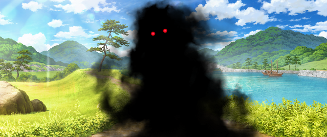

**==Battle against Various Monsters==**

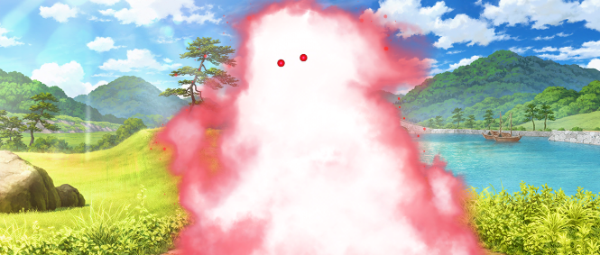

For some reason, the monsters explode as you defeat them.

Anyway, you head over to the village in pursuit of Sousuke. Before long, Sousuke comes running back, something in his mouth. He's found one of the necklace pearls! 

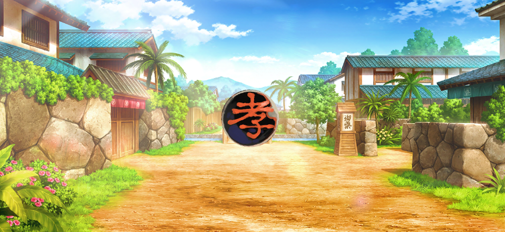

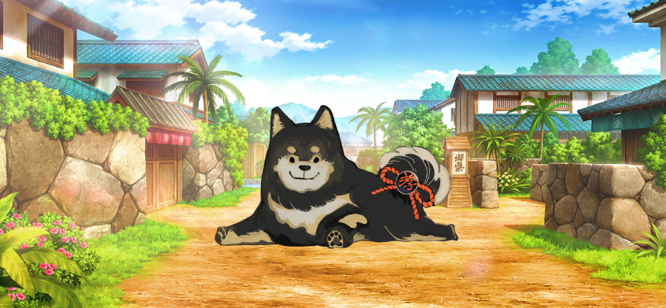

The one with the sign for "Filial Piety". This corresponds to Shino, another dog.

Shino is a Shiba-Inu and makes Barghest internally squeel. They're like a Chivalric Order of dogs! Izou comments that she's acting creepy.

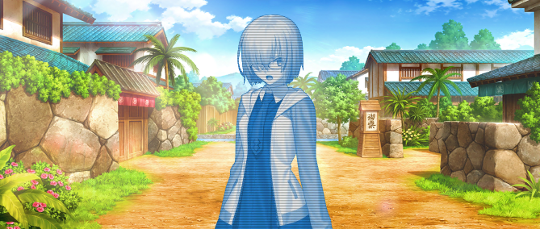

Suddenly, a unsteady signal comes flying in from Chaldea. It stabilizes, and Mashu reveals that Ushiwakamaru is with them. In any case, she'll first report about their battle situation...

## Dark Moon

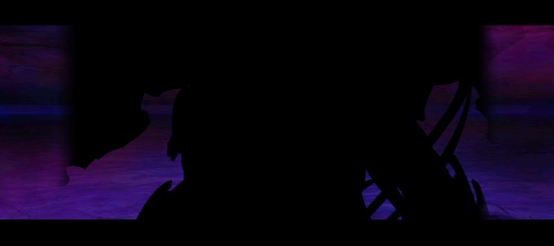

In a vast sea-like void stands a lone shadow.

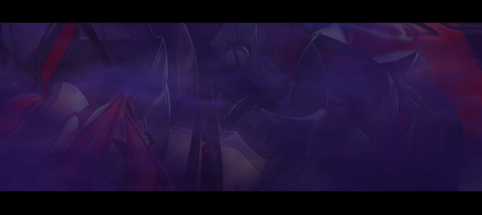

Calculation start:

An arrow worth 7 Spirit-Pearls was let loose.

No hero could deflect it alone.

And yet... Chaldea still stands.

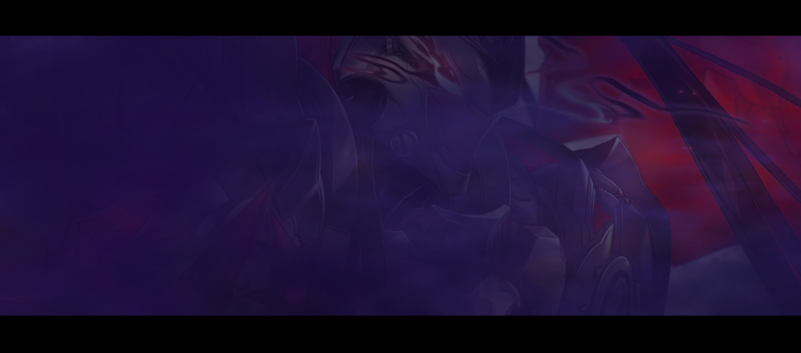

He must shed his regality.

He must become like a fiend.

Like a Rakshasa cursing even the moonlight.

For his way...

For his Kingdom...

## Southern Expedition's 2nd Arrow - The Appearance of a Lone Canine Rumbles the Isles

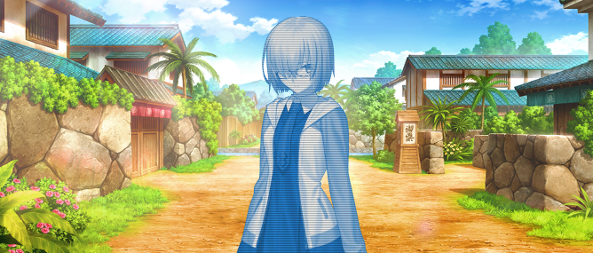

Mashu explains Chaldea's situation. They are under assault of the second shot, Though Orion managed to weaken it, it has now split up into countless smaller arrows. Chaldeas Archer's are currently being deployed to deflect them.

Either way, Mashu will assist them with information from now on. Bakin introduces Shino, who doesn't care. Shino is above such minor matters. Mashu correctly identifies that Shino was the protagonist of Hakkenden. With Shino, Bakin feels much stronger.

Barghest realizes that Bakin's poor form is whenever the dogs are far from her. Just like what happened when Sousuke ran off before. Izou scolds Sousuke for not thinking about his Master's problems.

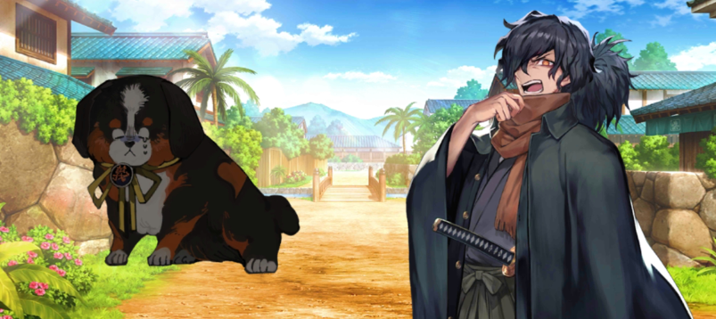

Just like in the original Hakkenden, the 8 Dog Warriors seem to attract each other by fate. That said, seems there are no more Dog Warriors around here. They prepare to get going but...

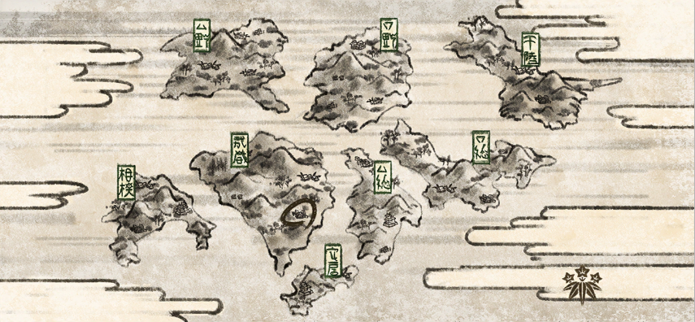

Hokusai spots an imperial proclamation written on a board. It appears to be a map of some kind, written in Japanese? Hard to read though... thinks Hokusai. 

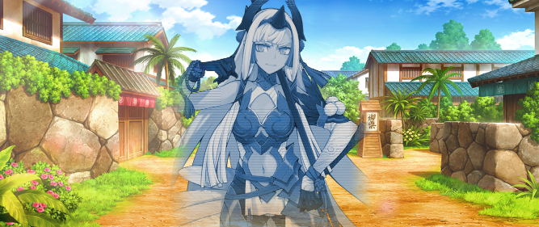

Kiichi Hougen shows up and explains that the strange letter is a Minamoto clan family crest.

Seems to have a deeper meaning to it than they can deduce. In any case, it's a map of the 7 Singularities, with a red circle marking their current location: Musashi. Musashi, Sagami, Kouzuke, Shimotsuke, Kazusa, Shimousa, Awa, Hitachi. All corresponding to the old regions of Kanto! All together, the map calls the islands: Nanso-hakkei. The same Nanso as in Bakin's Hakkenden.

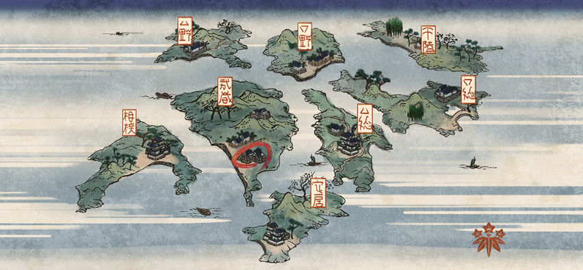

Bakin reveals her Saint Graph has been updated: she now knows the locations of the other Dog Warriors. Only the direction though. They should head for Shimotsuke.

Mashu speculates that each Grail they detected corresponds to one Dog Warrior, who further correspond to one of the islands. Perhaps looking for the dogs will help them locate Tametomo.

Barghest is still curious about Hokusai's connection, but for now it seems Bakin is more directly related to the Singularity: a good clue.

Izou is once again skeptical. Barghest growls. He doesn't mean anything bad! Izou doesn't feel its fair that they'll just use Bakin as a clue when she barely knows what's going on.

Hessian appears, cautioning against going to Shimotsuke: it might be trap. They settle on just collection information and then...

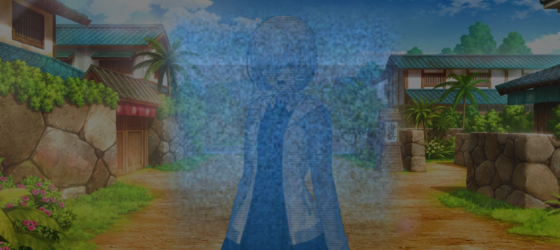

Mashu says sorry interrupting but, there's a massive energy wave coming onto them! The wave deflected by Orion has changed direction back to the Singularities! The islands of Hitachi and Awa are erased!

Mashu's signal gets weaker, but she manages to barely warn them to get out of the way. Barghest suggests perhaps returning to Chaldea, but Bakin says she'll deal with it.

Sousuke and Shino's powers combine, and start resonating with the Servants.

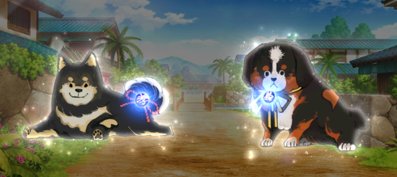

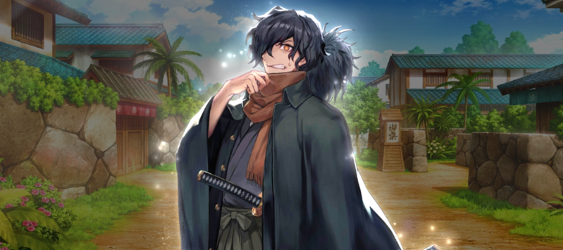

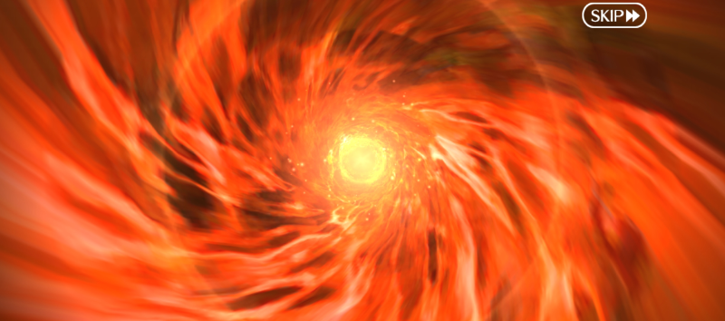

Suddenly, a reddish Rayshift looking phenomenon occurs. The arrows connect, and the island goes up in light...

## Chaldea's 2nd Bow - Shooting Down the Finest Volley of Arrows

Atalante, Chiron and Tomoe Gozen finds themselves in the sea of spacetime like Orion. They face up against the enemy wave that Orion caused to split.

Da Vinci informs that Orion did weaken its pure thermal energy, but in exchange its magical energy has increased. Her signal cuts out.

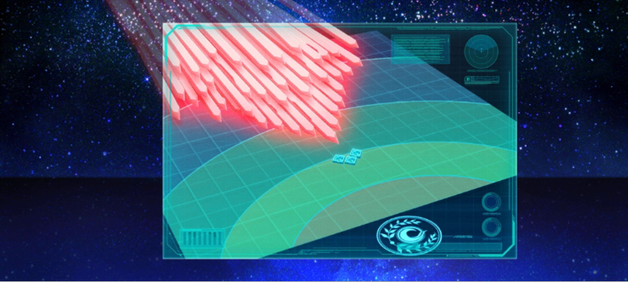

The Servants discuss their enemy. Tomoe had some ties to Tametomo in life, since he was Yoshinaka's uncle. She's never fought with or against him though, only ever heard of his tales. That they'd face up against each other now is the fate of Genji, she supposes.

They volley of arrows approaches, and the 3 Servants all activate their Noble Phantasms in response!

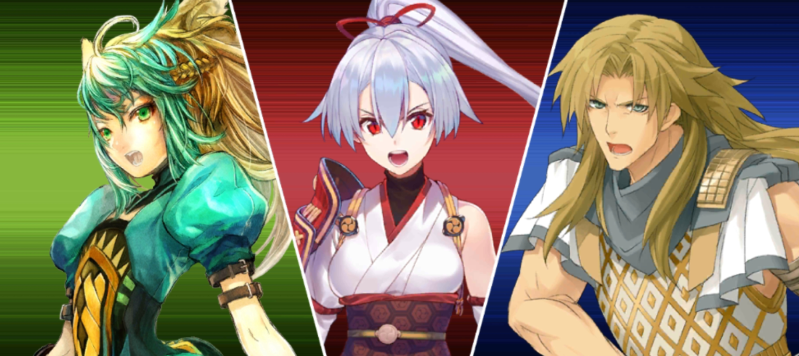

**==Battle against White Arrow Monsters==**

They managed to cut down on the volley's power, but are quickly running out of magical energy. Both Tomoe and Atalante return back to their pods.

Chiron stays behind and ponders something. It appears the arrows are getting stronger each time they are defeated. He'll transfer the data back over to Chaldea.

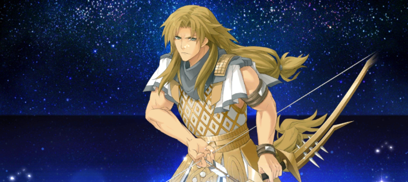

## Chaldea's 3rd Bow - Godly Bows Fletch Purifying Arrows to Cleanse Evil

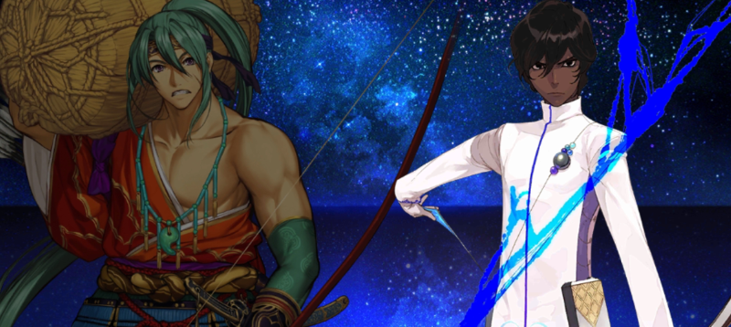

Arjuna and Tawara Touta face off against the horde of countless White Arrows.

**==Battle against White Arrow Monsters + White Arrow Centipede==**

Da Vinci gets her signal back. The enemy is going faster than anticipated. She's driving their pods at the same speed, but its too close. Easier to shoot them down then, reasons Touta.

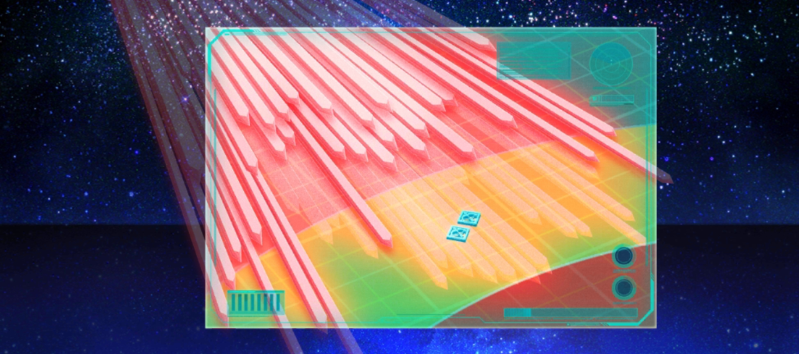

Arjuna remarks that he heard the arrow was supposed to simply be a very strong shot, but this is more like it's turned into the apparitions and foul creatures of lore. This is just as Chiron reported. The arrows are getting stronger.

Touta agrees. It seems they've become immune to physical attacks. What manner of theatre or fairytale have these sprouted from? No ordinary arrow could come this far.

Da Vinci is shocked to hear, but the words "theatre" and "fairytale" stick in her hear. In any case, it appears the enemy's Noble Phantasm has the ability to become resistant to their interception attempts.

In any case, the solution is simple: if their enemy lets off arrows of foul magic, they simply have to respond with ones of holy majesty.

Arjuna activates his Noble Phantasm. Touta starts getting the rice out... wait, wrong Noble Phantasm! Touta pulls out his bow and shoots off the right Noble Phantasm.

**==Battle against White Arrow Monsters + White Arrow Centipedes (with Physical Immunity)==**

## Southern Expedition's 3rd Arrow - The Four Virtues Assemble and Indulge in Gesaku

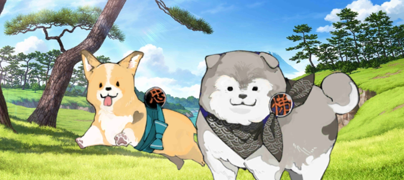

You wake up, stirred by a dog. Mashu's panicking voice can be heard as well. Either way: get up! You look around and the landscape seems mostly the same.

Mashu informs you that you were only unconscious for but a moment. Her connection is stable after the spacetime barrage ended. The effects of the attack appears to have faded. Should be safe for now.

It appears only Izou and Bakin is there with you. Hokusai, Barghest and Hessian Lobo are nowhere to be seen.

Izou points out you've they found two more Dog Warriors when they arrived here. As for Bakin herself, she's still exhausted from her fake-Rayshift thing.

Mashu points out that you're currently on Shimotsuke, the island Bakin pointed out before. Was this the power of the Dog Warriors? Bakin affirms, and introduces your two new friends: Tousetsu and Kobungo!!

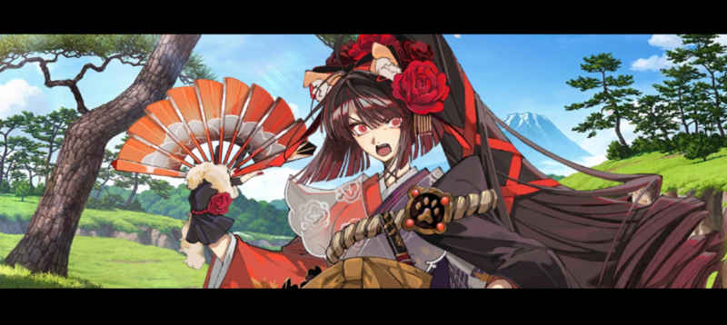

Izou is shocked at Bakin's new tone of speaking. That's simple, Bakin's personality has gone from Omichi back to its rightful owner: Kyokutei Bakin themselves! The famous author of the Hakkenden! Not to worry, Bakin knows their circumstances still, having seen them through Omichi's eyes.

Somehow Izou is dissatisfied: Bakin's way of talking doesn't fit the graceful body of his daughter! Bakin is so noisy!!

Mashu surmises that them having found the necklace pearls of "Elderly Respect" and "Loyalty" is what caused the real Bakin to emerge. Bakin affirms, they're quite strong now!

Suddenly, monsters appear. They can't go searching for their allies quite yet! These monsters seem to have been chasing the two new Dog Warriors. Sousuke heard their pleas for help and took them here.

Regardless, Bakin and Izou prepare to fight.

**==Battle against Various Monsters with Cloak of Hatred (Forced Kyokutei Bakin Support, NP Disabled)==**

Bakin reflects on the feeling of being a Servant. Strange that they had to manifest in Omichi's frail body. One thing is apparent at least, Bakin is still not in perfect form.

More monsters appear, and Izou thinks its gonna be hard to hold them back when... Lobo, Barghest and Hokusai appear and cut them down. Bakin gets excited at the sight of Hokusai.

But their reunion will have to wait: first they have to take care of the monsters.

**==Battle against Various Monsters with Cloak of Hatred (Forced Kyokutei Bakin Support, NP Disabled)==**

They've defeated most of the enemies in the area, but still cannot find Tametomo anywhere.

Let's forget about Tametomo for now and focus on the other Dog Warriors. With Hitachi and Awa's disappearance, they've yet to explore Kousuke, Sagami, Kazusa and Shimousa.

Bakin tells them to leave the transporting to her. They can't control it well, but it should be better than last time. Barghest gets a thought... What happened to Omichi now that Bakin is here?

Bakin starts explaining that Omichi is still with them, inside. Omichi and Bakin are one and the same, that won't change. But Omichi seems to have hid herself for the moment.

Hokusai is a bit disappointed, she wanted to talk more to Omichi... Guess Bakin and Omichi have a similar relationship to her and her dad. Well, he's an octopus though.

At the statement, Bakin goes into shock. Wait, Tetsuzou (Hokusai's old name and the way Bakin calls him) is that little octopus?! Guess Omichi never told Bakin about it!

But they should get going. It's only from Kazusa that Bakin can't sense any Dog Warriors. Since there's 4 left, that means that 2 Dog Warriors are on the same island. They have no idea where to go, so you ask Mashu for her opinion.

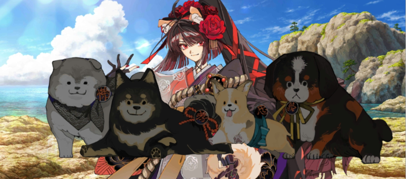

Mashu suggests Kousuke, which is next to their current location and one of the biggest islands.

Sounds good, let's get going then!

## Chaldea's 4th Bow - Though the Twin Bowstrings of the Western Winds Resound, Abnomality is Afoot.

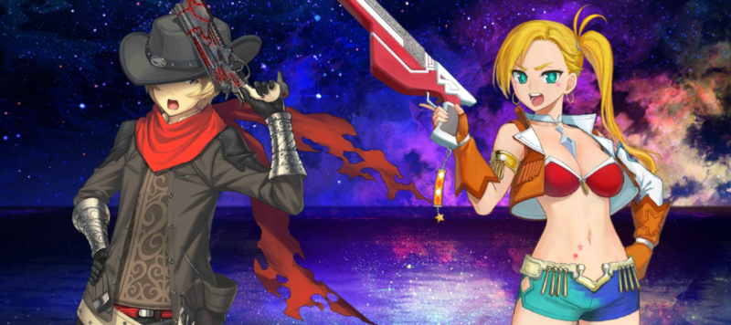

Billy and Jane are fighting in the cracks of spacetime. Though they fight on valiantly, they both have issues with the other's performance and quarrel vigorously.

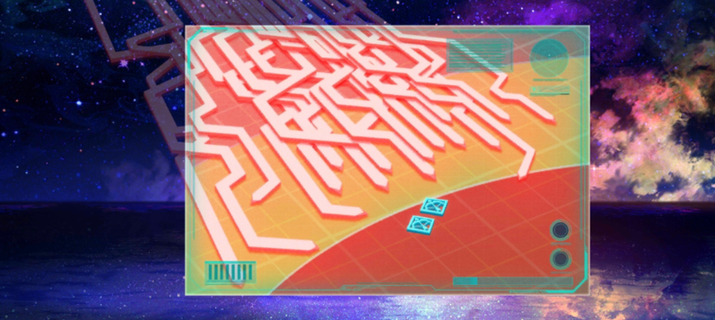

Da Vinci interrupts the quarreling to inform them the arrows have now gotten really fast and mobile. They keep predicting and dodging attacks, like swerving bullets. That's cheating, says Jane. Billy points out she does the same thing.

Before their argument can reignite, Da Vinci recommends they use their Noble Phantasms

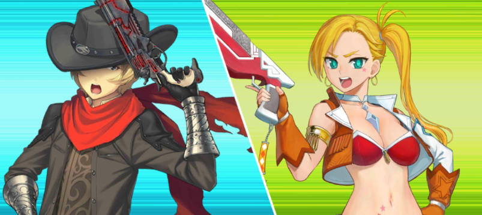

Billy and Jane activate their Noble Phantasms.

**==Battle against White Arrow Monsters with Agile Footwork==**

Jane and Billy go back to their pods. Ishtar's on standby, but... wait.

Da Vinci senses an abnormality: the arrows have started increasing; no, reproducing!

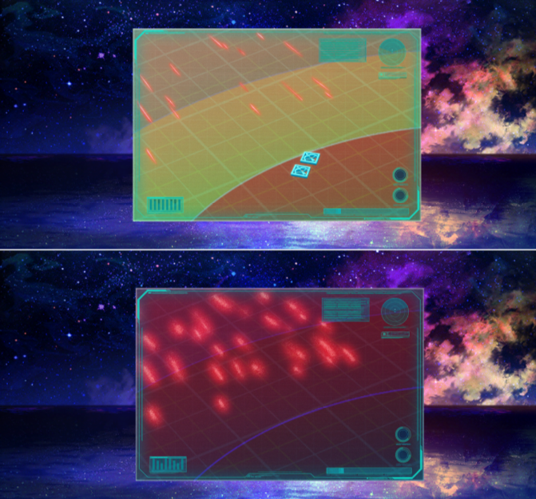

## Southern Expedition's 4th Arrow - Hiding in the Haunted City in Desperate Measure

Currently, you are on route towards the middle of the Kousuke island.

As it turns out, Lobo is currently carrying you by the neck in his mouth. You gave up your spot on his back to Bakin. No worries, Hessian can take care of a decapitated head should the situation arise! Mashu smiles. The Dog Warriors cannot enter spirit form, and so ride together with Bakin. The rest of your Servants are in spirit form. Barghest apologizes for the rush they've put you in, but at least this time their Bakin's Rayshift thing didn't separate them.

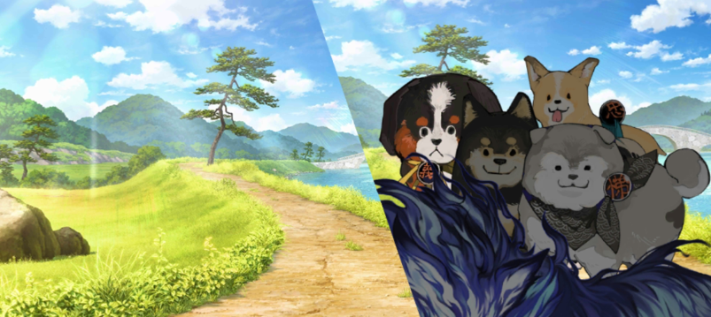

Bakin enjoys the sights, the weather, and the winds. What a great day to ride on a wolf's back. They're feeling kinda like Fusehime riding on Yatsubuki. Mashu explains: these are both characters from Hakkenden, Fusehime being the daughter of the Satomi lord, and Yatsubuki being her magical dog. Bakin is impressed at Mashu's knowledge. Bakin continues: in fact this whole place is like something they'd dreamt up for their books. This makes Barghest remember, right they were going through Tametomo's story because it had something to do with Bakin, before they got interrupted by monsters. Bakin has problem talking about their own books, but something about Tetsuzou's gaze is making them uncomfortable. Don't worry, telling stories is what writers ought to do, says Hokusai. They may have illustrated it, but have no right in feeling angry about it. Go on.

Bakin's Chinsetsu Yumiharizuki stars Tametomo as its protagonist, and though it follows history closely until his exile, the following events are from the realm of fantasy. Instead of killing himself and his children, Tametomo fled from his exile to the land of Higo, now part of Kumamoto in Kyuushuu. There he assembled allies and collected power until he could face his nemesis Taira no Kiyomori. However, his boats were struck by wind and drifted far south, to Ryuukyuu. There, Tametomo fought against corrupt sorcerers controlling the island through their monsters for the purpose or restoring it to its true ruler: Princess Neiwan'nyo. Barghest thinks princess and see Baobhan Sith in her head. As it turned out, Neiwan'nyo held within her the soul of Tametomo's lost love Shiramei-hime. Together with Shiramei-hime's son Sutemaru and his own son, does Tametomo save the country from evil and establish the true Ryuukyuu Kingdom! Cool story, but don't spoil it, says Izou.

Hokusai remarks that the monster kinda looks like her dad does now, well, in full form. It was input from the illustrator of Chinsetsu (Hokusai), much to Bakin's annoyance. Hokusai didn't illustrate for Hakkenden though, but left that to some apprentices instead. Though Bakin is known for Hakkenden these days, in the Edo period Bakin's fame rested on Chinsetsu quite a bit. Tetsuzou finds this obvious. Regardless, their long chat means they're almost at their destination. Lobo stops, and accidentally drops you as he does.

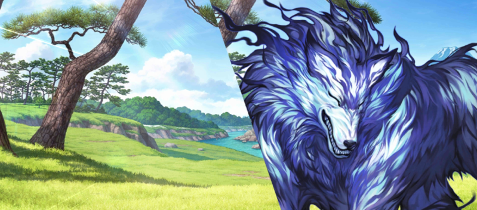

Once again they come across a village. Strange spirits are walking the streets. They're almost like shadows playing the role of villagers. They don't seem harmless, but Izou still cautions against standing out too much, worried for you. The massive Lobo and Barghest keep themselves hidden while Bakin, Izou and Hessian carry the dogs around. The aura of this place has made it hard for the dogs to use their sense of smell. You ask Mashu for analysis, but she can't make heads or tails about the place either. No problem, they'll find that Dog warrior some other way, says Hokusai. They eventually find an empty house and take camp.

After settling in, Hokusai comes in saying she's found another imperial proclamation. It's still hard to read, but now she can read "Duty", "Loyalty", "Filial Piety" and "Eldery Respect": the signs corresponding to the Dog Warriors they've found! Probably a kind of wanted poster. Unnaturally fast. Bakin presumes it has to do with the power of the pearls. Whoever is doing it is using the resonance of the pearls against them. Izou ponders it deeply and suspiciously.

One of the dogs tries to drink your water and get scolded. Barghest feels bad about it, maybe she should get something for them... Hessian comes in and suggests they wait until night for their search. If these spirits are awake at day they might sleep at night too. Mashu doesn't think you have enough time to waste, unfortunately.

Izou suddenly asks Bakin a question. He ain't all too smart but there's something bothering him. He's probably wrong but... better ask: Isn't Tametomo a king? Was he really this insignificant? That his country has no people except for paltry spirits? Would he really be satisfied with that? He needs to know what kind of person Tametomo is if he's gonna cut him down. 

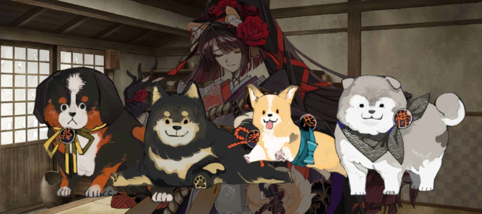

Bakin hesitates to answer, so Hokusai takes over: in truth, Tametomo never became king in Chinsetsu, it was his son Sutemaru. He never became a king, either in reality or fiction. Even 7 Grails don't let him make real human subjects from nothing. Something about him is odd. Bakin admits that yes, they're proud of making Tametomo so famous after his life, but even so the person himself probably regrets that he ended up killing himself and his children. He probably wants to be reborn in the world. Bakin asks if the short-lived Izou didn't want the same, but Izou denies it: he killed too many people to deserve a second chance. Bakin gets a bit sad at the thought. Izou died earlier than his Souhaku and lived a frightful life. Izou smiles. Ultimately that's how he wanted to live. He doesn't feel bad about it. The Dog Warriors cuddle up with Bakin and comfort her...

Later, Lobo returns to report a disturbance outside. One of the Dog Warriors is being crucified! 

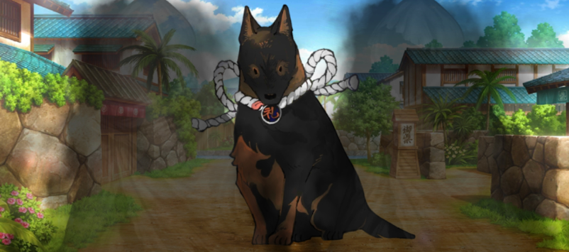

They rush outside and find the "Manners" Dog Warrior: Daikaku. Lobo oouldn't find Tametomo in his scouting, but he did find this. Is this a trap to draw them out? Or just torture? Daikaku howls in pain. Barghest and Lobo look on in anger. You want to save him, but Izou cautions against it. Suddenly, Mashu reports of a signal coming from the previously assumed disappeared Awa: the sixth Dog warrior is approaching. Hokusai starts yelling at Bakin to do something about their goddamn dogs. The 6th Dog Warrior appears: Genpachi holding the pearl of "Trust". With this many dogs assembled, Bakin has something they want to try. You accept.

Izou and Hokusai stir up trouble to act as decoys. Bakin begins her chant. The Dog Warriors combine into one watchdog: the magical dog Yatsufusa. 

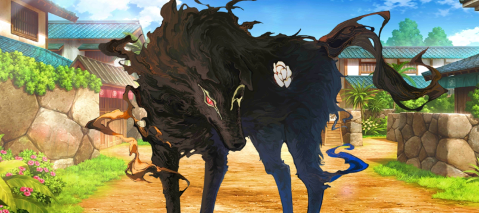

Or rather, since she only has 6 Dog Warriors, Roku(6)fusa. With this, they'll break through the enemies!

**==Battle against Various Monsters==**

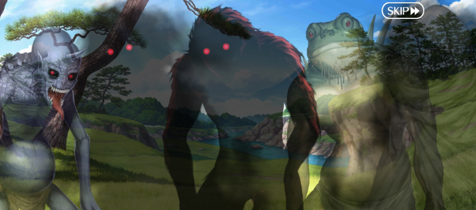

After your success in battle, you have fled the city. The monsters are still in pursuit. They can't deal with the hordes, but all they need to do is escape. Bakin's power starts to diminish, and Rokufusa divides back into its component Dog Warriors. Bakin bids farewell, and suddenly Omichi takes over their body again. But you have no room to consider anything: the enemies are coming.

**==Battle against <Various Monsters==**

One of the cat monsters corners Bakin during the chaos of battle. The monster takes a hold of Bakin and teleports them away. Before disappearing, Bakin tells the Dog Warriors to stay behind with Chaldea. Only Sousuke goes with Bakin directly. Mashu analysis reveals Bakin has been transported to Sagami, probably.

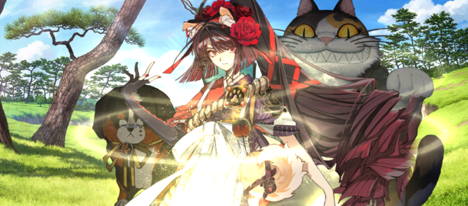

## First Day

In a vast sea-like void stands a lone shadow.

The Archers who have fought up until now are pondered upon.

Magnificent! Such valor! Such cleverness! Such grit!

They are but slightly above, still.

Yet even so, he must become a true king.

And Chaldea will surely try and stop him.

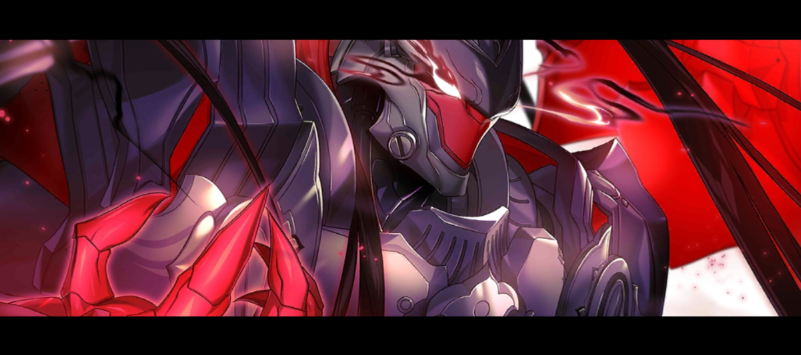

Calculation start:

Inconsistency in guiding principle: ERROR

He is but a machine.

For him to let off the arrow of victory: ERROR

He seeks.seeks.seeks. his true lord: ERROR

Wrong---wrong.

He may be a mere fiend of archery, but he is his own king!

Upon this sea he shall build a world of warriors, ruling as the lord of Nanso.

## Chaldea's 5th Bow - Repelling the Veil that Darkens the Evening Stars

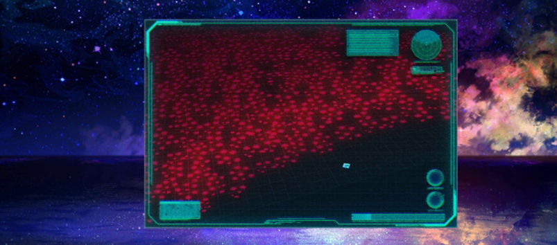

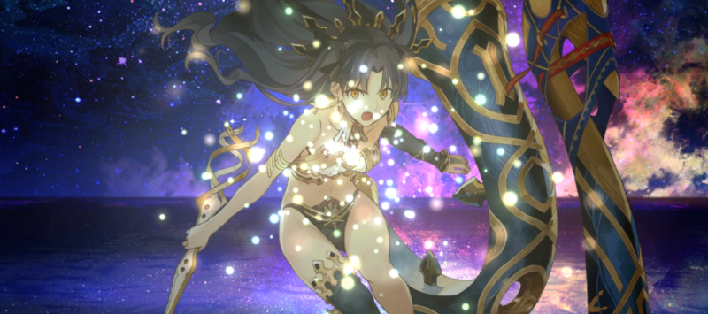

Ishtar appears out of her pod. Sion had remarked she would be most suited toward making up for the others' failure. Ishtar doesn't feel great about the situation regardless, almost like she's been tricked, standing here alone and all. Besides, what they're up against isn't just an arrow: it's a Noble Phantasm of Stories. Tametomo was just its launch pad. That's why it just keeps coming even though they keep repelling it. Ishtar starts readying her Noble Phantasm when...

Someone calls out to her: EMIYA. He hands over some gems he got from Goredolf, hopefully they'll prove invigorating. Isthar is overjoyed. She'll double her efforts. They formulate their plans: Ishtar will lead the attack with her Noble Phantasm while EMIYA cleans up the stragglers. The battles commences!

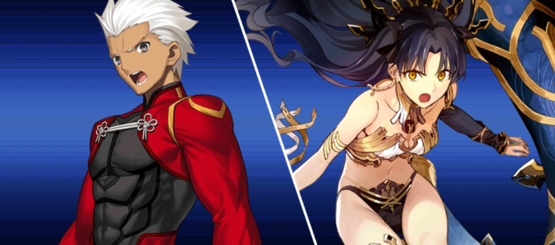

**==Battle against White Arrow Monsters with Strong Armor==**

The pair missed shooting down one single arrow, which is now heading towards Chaldea. Da Vinci panics. Arach, Gilgamesh, Ko-Gil and Robin Hood are on standby inside of Chaldea, giving some scathing commentary concerning Isthar's fuck-up. Robin Hood wonders what the big deal is: it's just a single arrow, no? Da Vinci says this is an Arrow of Gu, concentrated poison, a curse compressed onto its utmost limits. Truly a fatal blow. If a Servant were to block it with their body, they'd be corrupted and turn into another arrow. If it connects with Chaldea, its concept will infect them, activating the 'fate of sinking'. They have no choice but to meet it head on. That's what would work in a story; a story like this arrow. There's not much time left. They have to pick an Archer for the mission soon!

William Tell appears and volunteers for the mission. The other Archer in attendance agree. There's no one quite so good at shooting down a single arrow like him.

William is taken to the interception point, appearing out of his pod. He's only got one chance! More than plenty, no need to worry, William reassures. When it comes down to it, if everything depends on you hitting, then you just have to hit. Quite simple. William activates his Noble Phantasm...

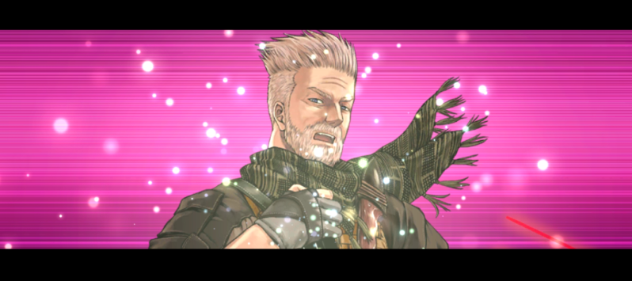

## Southern Expedition's 5th Arrow - Following the Path Reminiscent of Lords and Abducting her Away

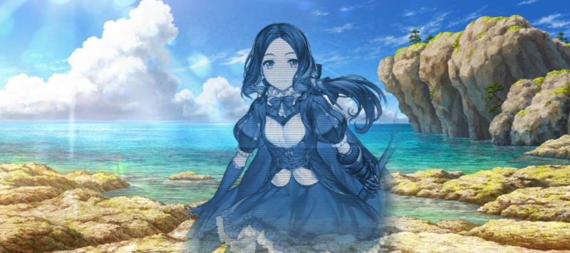

A bit before...

You report to Da Vinci that Bakin was abducted by the cat monster. As a result, you have no means of transporting yourself across the island and need assistance. Normally there would be nothing Da Vinci could do but... this place is special. It has a 'imaginary landscape' modelled after Bakin's stories. In addition, the Dog Warriors have an affinity for transference. That's probably why Sousuke appeared in Chaldea, and some of the others appeared out of nowhere to help. There's the whole thing with the Spirit-Pearls from Hakkenden as well. Probably has something to do with the Holy Grail signatures they detected, but regardless...

If they can use this property, they could probably execute some large-scale Transference Magecraft. Still, there's a limit to what she can accomplish. Chaldea's resources are spread thin. They just sent out Isthar and Emiya to repel the arrows. They can't afford to waste any resources on misses. Barghest interject: that won't be a problem, the Dog Warriors can sense each other, they won't miss. You ask of Da Vinci to commence, and are engulfed in the same red Rayshift like thing as before.

When you arrive, Mashu reports you've successfully gotten to Sagami. Unlike the other islands, here is a castle. Mashu suspects there's a Dog Warrior inside, either that of 'Chivalry' or 'Knowledge'. Barghest suggests she and Lobo play bait so the rest of them can infiltrate the castle. Izou and Hokusai will come with you into the castle. Someone will also have to look after the Dog Warriors: they can't afford to lose any more of them. Hokusai suddenly wonders why Bakin turned back to Omichi. Izou dismisses the questioning. They'll find out eventually.

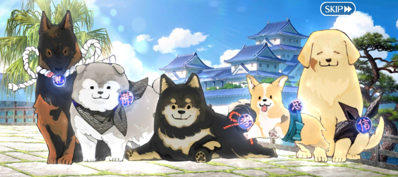

Various monsters are prowling the streets. Suddenly, Lobo appears in front of them. For some reason this prompts the Dog Warriors to follow him. Barghest starts to panic, urging them to follow her instead, Lobo is about to fight, it's dangerous!

**==Battle against Various Monsters (Barghest + Hessian Lobo Forced Support)==**

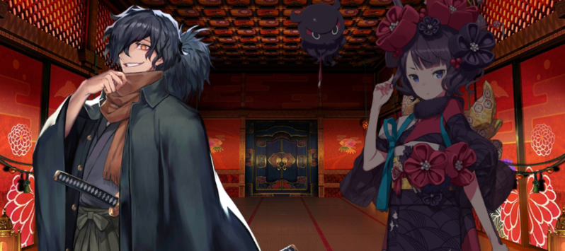

You and the infiltration party arrive inside the Castle. Izou carried you. Mashu will inform you if she detects anything out of the ordinary. They hear the commotion going on outside and get going.

Izou asks Hokusai about this "Souhaku" that Bakin mentioned before. Hokusai explains that Bakin once had a son he saw as his heir. This was Omichi's husband, and how she was married into the family. But Souhaku had a sickly constitution. A few years after Omichi and him married, he died in his sleep. Omichi took over as a successor, even though she should've just returned to her original family. Eventually Bakin lost his sight, and dictated his writings through Omichi. Izou thinks living a life where all you do is take care of some old fart is about as boring as it gets.

Before Hokusai can respond, a cat monster appears behind them. Izou will take care of it before it calls more people over.

**==Battle against Various Monsters==**

The monster you just defeated is the same as the one that abducted Bakin. Hokusai asks if maybe Mashu can analyze it. Mashu does, and says she can detect them well enough that they shouldn't run into them out of nowhere like they just did. Anyway, they don't have time to wait around.

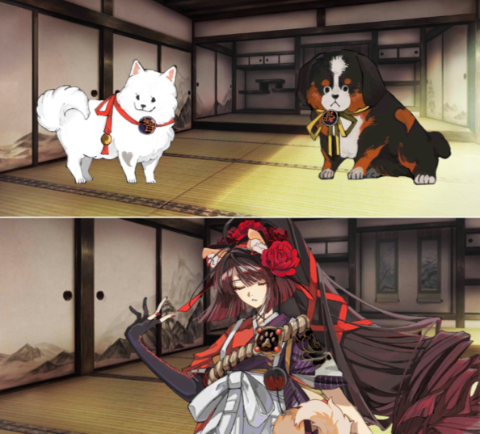

You follow Mashu's lead and eventually found a sleeping Bakin. Sousuke is there as well, together with another Dog Warrior, the one with the pearl of "Knowledge". They're tied up around their necks, however... Hokusai tells you to stop: if they know Bakin is fine, they should just leave her here. Everyone else is shocked, but Hokusai reminds them of their purpose: find the dogs, locate Tametomo and stop the attacks on Chaldea. Izou says he'll follow your lead but... there is something he wants to know about Bakin. Isn't she just being used by Tametomo? Not to say everything she did worked in Tametomo's favor, but at least its been close enough that he can't help but be suspicious. Also, there are two islands left: Kazusa and Shimousa. There is only one Dog Warrior left, on Kazusa, meaning that Tametomo is on Shimousa. No need to go around being all lost.

In any case, Hokusai insists on leaving Bakin and the dogs behind. Mashu protests, they at least need some way of moving around still. Izou says that won't be a problem: you will do something about it. You don't get what he means, but before he can explain fully, more monsters arrive.

**==Battle against Various Monsters==**

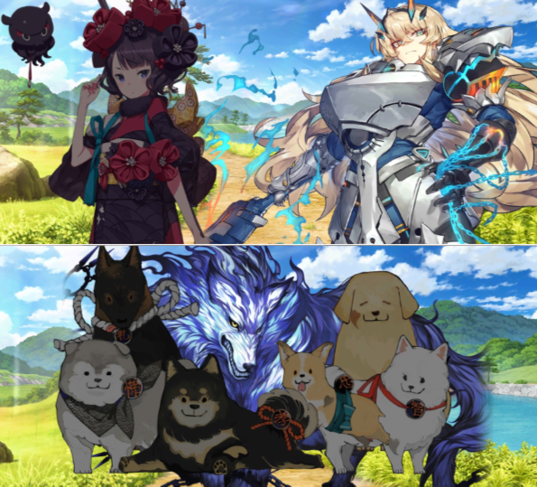

You return to outside the castle where Lobo and Barghest are fighting. She wonders what's up with Bakin who you are carrying with you, but there's no time to explain. You have to get out of here before you get overwhelmed. The Dog Warriors greet their newest addition.

Bakin still won't wake up. They could head to the final island where Tametomo is located without Bakin but... You listened to all that Hokusai said, and still, you can't leave Bakin behind. To understand why Tametomo is attacking Chaldea then the mystery of Bakin and Omichi must be solved.

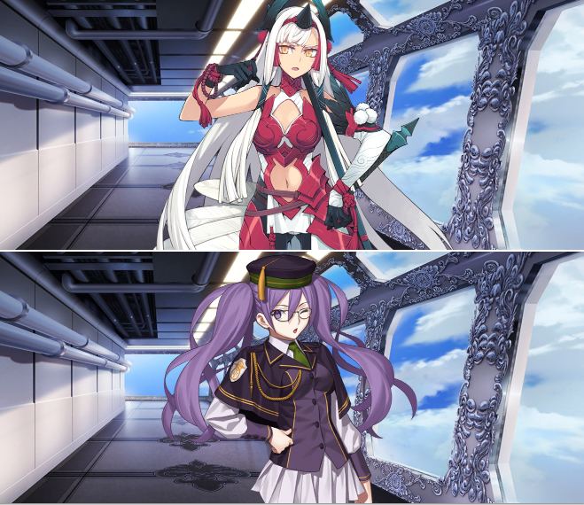

Back at Chaldea, Kiichi is talking to Sion about Bakin. Shouldn't she reveal why she made them take Bakin with them already? From Kiichi's deductions, wasn't it because Sion suspected that Sousuke and Bakin was used as a way to detect where to shoot? Certainly, one could make such a case, says Sion. However, she actually deduced practically the complete opposite. The fact that Tametomo's famed 'ship-sinker' did not take out Chaldea in a single shot should've meant his defeat. But this first shot was always meant to be accompanied by another. So what if he'd shot many of these 'trackers' before the arrow they know as the first actually hit? During that time, Sousuke and Omichi used other methods to try and reach Chaldea. The slight presence of the Holy Grail felt in Sousuke was something he then used to ever so slightly divert the first arrow. That's why they survived. Basically: Sousuke and Omichi knew Tametomo was aiming for them, and appeared to stop it. Perhaps doing this caused such a loss of power in Bakin that they themselves don't know what they did anymore. Kiichi asks if that means Sion made Bakin follow along to protect you and the others then, but get's a No Comment. The situation is unfolding too quickly, who knows what is going on anymore. Bakin's true objective is still unknown.

Goredolf appears between them and urges them to return to the control room. He has the feeling that if the two weird geniuses of Ushiwakamaru and Da Vinci are left alone for too long something bad will happen!

## Southern Expedition's 6th Arrow - Bloodied Struggle against The Tiger Painting as Red as the Crescent Moon

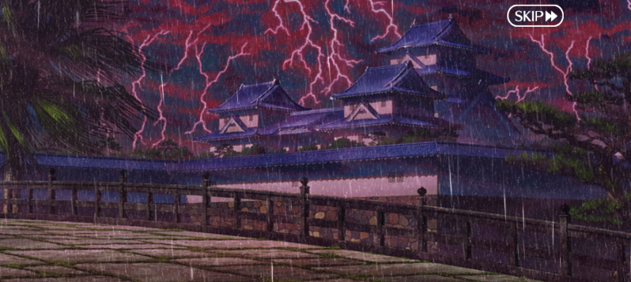

You arrive at Shimousa... storms of reddened lightning blanket the heavens. It appears this island suffers great damage each time Tametomo fires. This is something else. No matter how powerful a bowman, this shouldn't happen upon firing an arrow. Mashu detects some enemies, but more importantly, the magical energy in the surroundings are converging onto one spot... Tametomo. They can finally see their enemy now. 

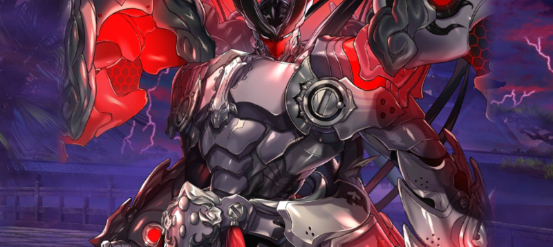

He speaks out to them: 

Defining engaged. He is the lord of Nansou. 

Have you come to swear allegiance? You say you've come to defeat him. 

Enemies confirmed. 

You ask about his motives, and he relays that Chaldea are the enemy of all who seek to disrupt the flow of time. They would try to destroy his kingdom, no doubt.

Mashu remarks that his magical energy is still rising. He's preparing for the third shot. Chaldea cannot endure another shot, they have to stop him. 

Then, you shall fall to the bottom of this sea of space-time, declares Tametomo.

**==Battle against Minamoto no Tametomo with Noble Phantasm Sealed (ends after 2nd Break Bar)==**

Calculating damages: minor. 

However: all damages inflicted delay 3rd arrow. 

Targets must be eliminated quickly. 

Use power of the Holy Grail: Denied, 3rd arrow would be further delayed. 

Decision required: ERROR, ERROR. 

Contradictions in actions from the start: ERROR.

Your battle against Tametomo is fierce. Yet, Tametomo has still not given up on his 3rd shot. They have to stop him! But he's too hard to approach, fending off all attempts with his precise archery. You ask if Tametomo doesn't have any weaknesses from his legends. Not the most gentlemanly thing to do, but Hokusai will accede. In order to ascertain his weakness she'll need more than usual. Hokusai transforms in her last ascension: Poppa mode!

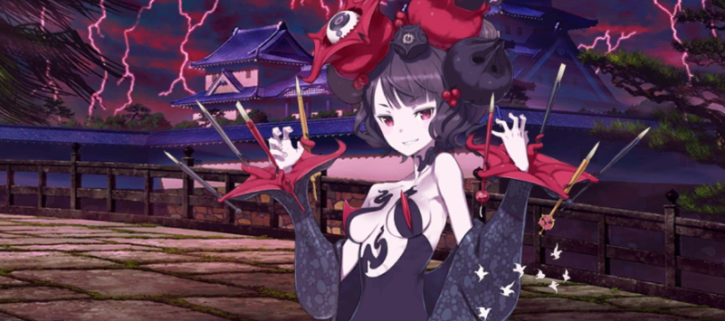

Tetsuzou calls out to the sleeping Bakin in an angry voice: hey, Kurazou! Aren't you ashamed at this situation?! This Tametomo is their hero! Tetsuzou at least can't stand to watch anymore! But the one who wakes is still Omichi, who warns against trying to wake her father. The one who wrote this whole scenario is... Omichi gets another headache. Izou interrupts, its now or never. Suddenly, Bakin wakes up, urging Tetsuzou about the 'right' and 'left'. At the back of your mind you wonder about Omichi's warning but... for now you have to fight!

**==Battle against Minamoto no Tametomo==**

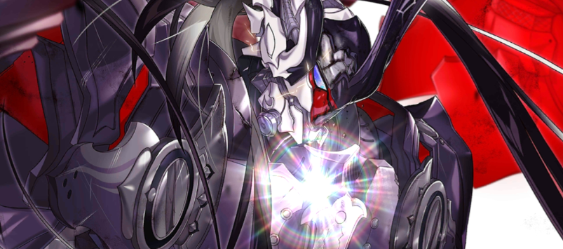

Tametomo's armor cracks. From within his armor, the last Dog Warrior emerges, representing the virtue of "Chivalry": Jinbee. Mashu commences analysis. Tametomo's magical energy is no longer enough to support a 3rd shot. Tametomo is bewildered, was this dog within him the entire time? Bakin apologizes to Tametomo for pushing this task onto him and beckons Jinbee to return to them. Tametomo returns to his first ascension, and he seems different, almost like he was being forced into Madness before. Mashu warns them to be on their guard still, Tametomo's power isn't dispersing its almost like its being transferred before she can finish, the signal to Chaldea cuts off.

Hokusai immediately glares at Bakin. 

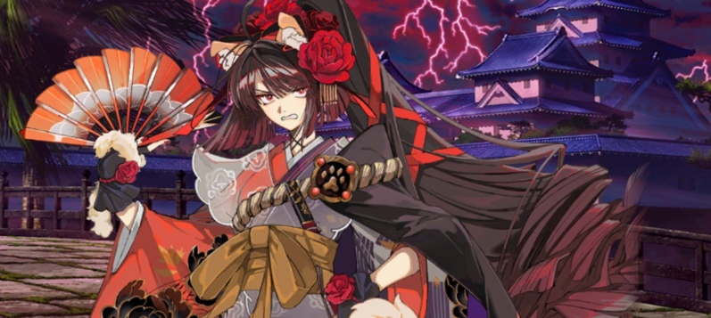

There's nothing to hide anymore, Bakin says. It's a shame Tametomo could not finish the job. Seems they'll have to put an end to this story all by themselves. 

The 8 Dog warriors return to their spirit-pearl forms, and converge onto Bakin. In the wake, they're transformed, with Yatsufusa behind them. Bakin announces that with their connection to cut, and their access to the Dog Warriors lost, they've lost their means of transport. Now they can be left behind, unable to interfere with her plans.

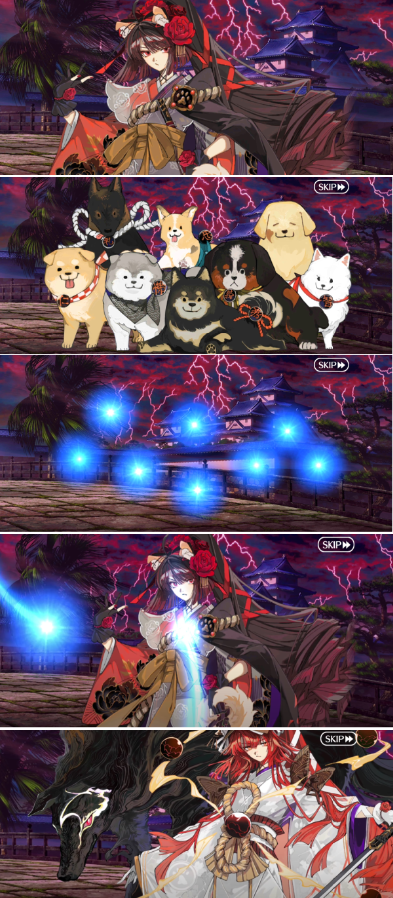

This is Fusehime, the princess of Satomi, announces Hokusai. Even in that form, Bakin still takes Omichi's appearance, aren't you ashamed? Look yourself in the mirror, Tetsuzou, answers Bakin. Lobo attacks, but is repelled by Yatsufusa. Bakin unsheathes her sword, Murasamemaru, and attacks.

## Southern Expedition's Final Arrow - The Camellia's Leaves Fall while Waiting for Spring That Will Never Come

In the aftermath, it turns out all Bakin did with their newfound powers was escape. Izou suddenly feels something heavy in his pocket. Out comes Sousuke, happily sidling up to Izou. Together with the dog, is a faint-looking ghost of Omichi.

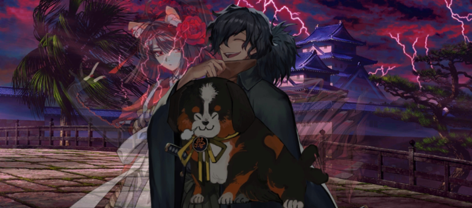

Omichi starts explaining her father's plot. Though first, she feels compelled to apologize to Tametomo. 

Tametomo's body has suffered damage, but his circuits are back in order. He can think freely again. His name has been dragged through the mud because of all this... 

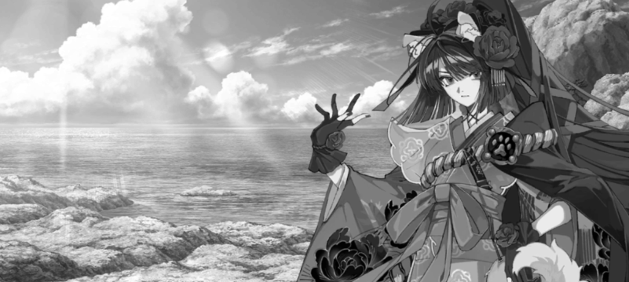

In any case, her father's plot was simply an attempt to resurrect Souhaku. He wanted to use the power of the Holy Grails to give Souhaku shape and have him come to the land of Nanmei/Nansou as a stray Servant. But that was never to be. Souhaku was never a Heroic Spirit to begin with, and Bakin never had any learning in necromancy. 

All he could do was write. In the end, all he could manage to summon was Tametomo. 

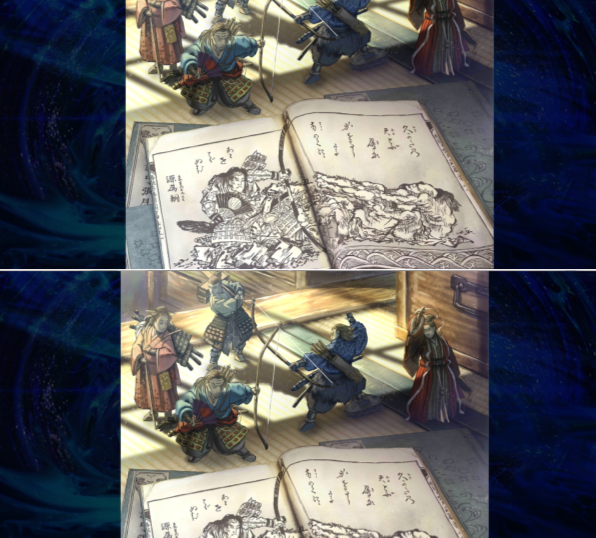

Bakin had always wanted Souhaku to follow in the path of the warrior that he himself never could. He himself had lived in the Edo era, where no wars were waged. His family had ceased being warriors, and become doctors. 

Before long, Tametomo spotted Chaldea, and Bakin became afraid that all he had created would once again be taken from him. He had begun seeing Tametomo in the same way he had Souhaku. But Tametomo could never fully realize those expectations.

Tametomo speaks: He is a weapon meant for painting the battlefield in blood. He is meant to be wielded. Yet things are not always ideal. There are those who would wield him for evil purposes. At this, Tametomo loses his purpose, and becomes subsumed in madness. 

Still, Bakin wanted Tametomo to display his own honor. Those were feelings he could obey. In any case, Omichi knew of Bakin's plot, and rushed to help Chaldea. When she did, the other 7 spirit-pearls scattered across the islands, and she lost her memories. 

Once enough of the pearls had returned, Bakin's consciousness could be reconstituted. Even with their master gone, Tametomo could use the spirit-pearls power to continue his assault on Chaldea, as they were connected to the land Bakin had created. 

Tametomo feels no regret in having shared this information but... he's recovered now and thus, he must let off an arrow. You will be that arrow.

Everyone is shocked. Tametomo continues: This is a recreation of the second arrow that passed the first in flight. Basically its like that time in Camelot with Arash... This is farewell. Hopefully you can take this as an adequate apology for his actions. He will provide the lift, and Sousuke will lead them to the right destination: toward Bakin. Omichi reveals that since she's still here with them, Bakin is now blind. She is his eyes, after all. He now only relies on the scent of Yatsufusa. This is their way to victory.

Tametomo changes mode to Faint Moon Contraction: Tsukuyomi-style Revolving Cannon, Sublimination - Crescent Moon Bow. 3... 2... 1... LIFT-OFF

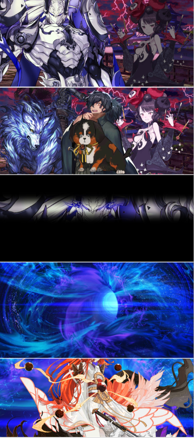

Bakin is in retreat through the rifts of space and time. Yatsufusa leaps through the darkness, feelings the waves of time brush against his mane. Even now, Bakin is only barely able to maintain their form, even though they retrieved the Grails they'd given to Tametomo. They're missing a piece. The piece of "Duty". Even now they are assailed by feelings of shame. Did Omichi betray him? Did Tametomo fail him? No, the betrayer is...

Hokusai proudly explains how having a Foreigner-class Servant here is handy. These kind of space-time rifts are where they thrive. Even so, it's hard to protect everyone from the streams of space-time from just you and Sousuke. Everyone else is in spirit form. You talk a bit about how Oei once related how Hokusai and Bakin always were at each other's throats, both of them wanting to dictate creative directions. Besides, Bakin is the one who took the planned 12-volume Yumiharizuki to 29 volumes. And despite that Hokusai followed along the whole way! He better be grateful! I guess quarreling with him was kinda fun... Well, once they both got famous they could sell on their own terms, so no more need for collabs.

Sousuke barks. They've finally caught up with Bakin. Your Servants return to their physical form. Bakin prepares their Murasame, and orders Yatsufusa to see for them. 

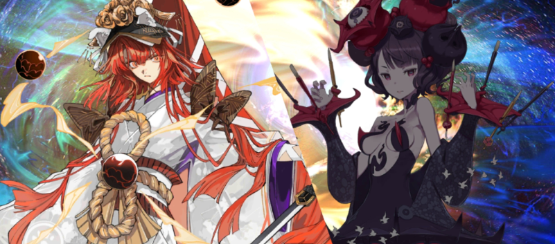

Izou smiles. If you're gonna go for it, go all out. This is what ol' Bakin always wanted to do right? Writing Gesaku was never the goal. Bakin just happened to be a genius at it. But that's all they ever had. Even with their sight lost, even with Souhaku dead, Gesaku was all they ever had. Quite different from Hokusai, who only ever wanted to paint. Well time, time to fulfill that dream of yours: Izou draws his sword. Whatever Bakin's grand objective may have been, that's none of his business. He'll say this though: this whole business about bringing back Souhaku is a sham. Bakin can't stand in for his son's regrets. Souhaku's life was his own. Yet he had a great companion by his side, and now you feel bad about making her take up after him as well. Omichi pleads for Bakin to stop disgracing both Souhaku and Tametomo.

Bakin looks down, wishing he could have been stronger. But what could he have done. If you had acquired the boundless yet simple power of the Grails, what would you have done? This power flowed through space-time, bringing people's wishes for writing, for gesaku, together. And then Bakin awakened. That's when he knew, that he had been granted an impossible second chance. So, if you had acquired such power out of the blue, enough that it could bring back your beloved who lived a life of misery, would you miss it? Of course you wouldn't. You would abandon the precepts of this world, and kneel before the power of the Holy Grail. Bakin is fully aware of the mad road he travels, but he must travel it nonetheless! Come, Yatsufusa!

**==Battle against Kyokutei Bakin==**

Bakin's Fusehime form crumbles...

## Epilogue - Tap the Quiver and Resound with Excitement

Back at the Chaldea control room, Mashu and Da Vinci are panicking as they sense you returning, but without any kind of Rayshift. They're unable to sense any enemy signatures. Da Vinci has to play it safe, and leads you onto their security blocks.

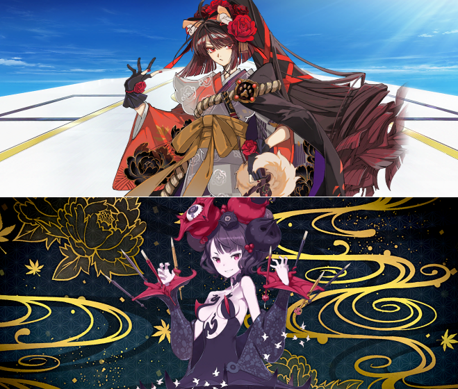

On top of Storm Boarder, Bakin and Omichi are staring each other down. The battle is over. Hokusai explains to Bakin how at Chaldea most Servant don't care too much about the Holy Grail anymore. They're here because they want to protect humanity. Hokusai is different, they just want to paint. But what fun is there in painting a world painted over with nothing but white? Bakin feels miffed. Doesn't need to hear it right now. Besides, they're different: Hokusai paints that illuminated in daylight, while Bakin writes of that lost in darkness. Hokusai remembers despite their differences, how much they loved talking to each other. They'd go over Houshin Engi, Suikouden, Kintarou and so many more stories together. That's what lit the fire in Bakin's heart about being a warrior.

Bakin reflects, admitting their mistakes. Besides, the reason why Omichi scurried off to Chaldea was because a part of Bakin wished as much. Chaldea has the the right way to think of the past: respect it, always think of it, and pass it on to a new future. Bringing it back is the ultimate folly. Sousuke runs up to Bakin in comfort.

Mashu appears on deck and greets them. William Tell appears as well, having returned from his mission. You ask Mashu about the other Archers, and they're all on their way back to Chaldea as of this moment. 

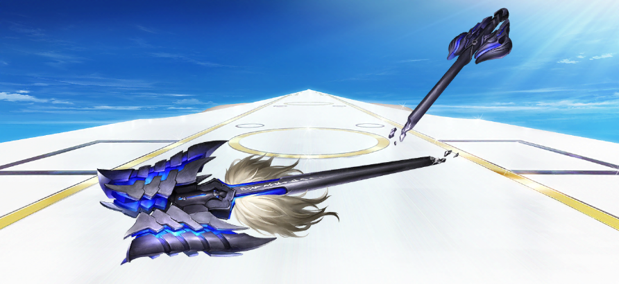

William has something in his hands though... the final fragment he managed to retrieve from the shot. 

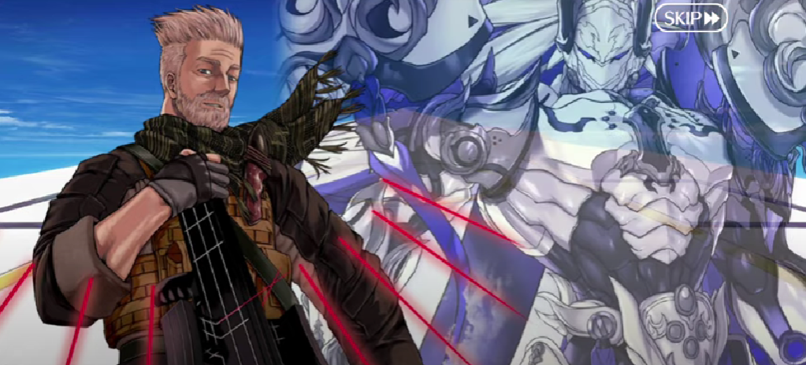

Within this broken arrow fragment resides a tiny bit of Tametomo, looking half-transparent and ghost-like.

Later, people are gathered before Tametome inside of Storm Boarder, and he offers an apology. He may have been under Bakin's control, but he still wanted to give a proper apology for causing so much trouble. William says he'll stand for all the Archer and answer. No worries, Tametomo. It's all water under the bridge. Goredolf feels slightly bewildered at how the Archers seems to have just felt it a good exercise. He scolds them to take things more seriously.

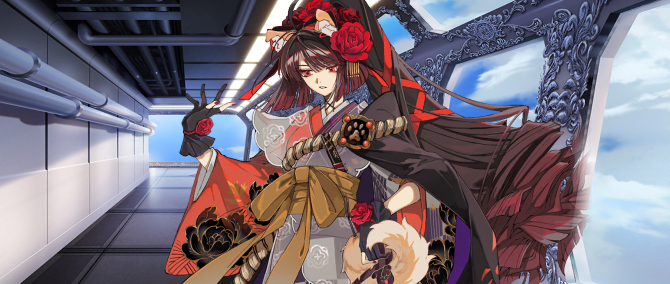

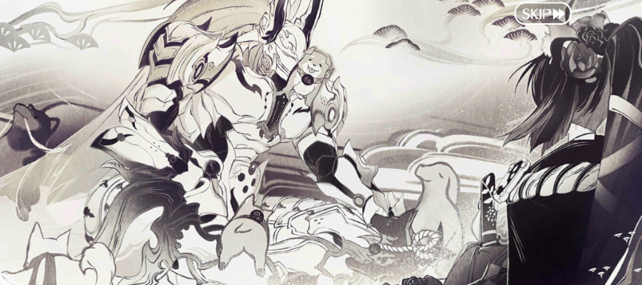

Bakin wonders if Tametomo despises them. Tametomo falls silent, but then answers that the dream Bakin let him see was something pleasant. He was a father, but also a child. He had loyal retainers. Bakin told him many tales. Exciting, tales of adventure. He does not despise Bakin. All he feels is pride. Bakin feels relieved.

Omichi looks on, and begins to fade away. She says her farewell to the comrades she knew during your adventure. Barghest praises her strength throughout all the ordeals. It was strength that even the Fairy Kingdom's great knight had to admire. Lobo says his farewell in his own way. Finally Omichi addresses Izou. She had thought him a real ne'er-do-well at first, but as it turns out, he was truly the embodiment of "Loyalty" itself. Izou doesn't really get what she's talking about: praise him more simply! Finally, Omichi disappears.

Bakin and Tametomo too are about to disappear. They say their farewells to you. If Bakin is ever summoned here again, they swear to act under the principle of "Duty"! They fade away.

Hokusai looks miffed. You shouldn't be so forgiving to that dumbass: shoulda just kicked him out! Mashu looks exasperated. Bakin and Hokusai will argue on forever if that re-summoning takes place.

---

All the people involved in the mission are gathered in the cafeteria.

Barghest notices that Baobhan Sith seems drunk, who gets upset at having Barghest pity her: this dumb mutt just want's to virtue signal. Man the goody-two-shoes have it easy, getting all the new screentime because they're so straightforward and hardworking. Also, why the hell is David acting like he owns the place putting on a party: he barely did anything! Baobhan sith hiccups and then admits nobody wants to talk to her so she has no choice but to sit in a corner and drink. Barghest sighs and sits down next to her. Don't worry, she'll tell Sith about all the cute dogs she met on the adventure over a couple of drinks.

In another part of Chaldea, Lobo and Izou are staring each other down. He admits to the wolf that he felt bad with all the commotions. Didn't fit in. He'll come back drinking some other time. Hokusai, now back in Oei-form, appears behind him. She's been wondering why Sousuke was so obsessed with Lobo and Izou. According to Barghest its because Izou is part-dog, so maybe Sousuke saw Izou as one of its own? Well, Hokusai knows the real reason: If you open up a copy of the Hakkenden and confirm just what kind of retainer Yatsufusa was, I'm sure its easy to understand. Also, Hokusai has to apologize to Lobo. There were many times where he got mad at how the Dog Warriors were used by them. Hessian always held him back though. Lobo was probably mad at the dogs being uses as familiars.

Goredolf breaks into their conversation: could they please go back and get some order on the commotions? If this continues it's gonna affect tomorrow's performances. Hokusai asks him a question instead: what does he think about pets? Goredolf thinks about it. Pets can never be in an equal relationship as long as their species and form of communication is different from their owner. Taming is a selfish act, but one that civilization is built upon. Still, he feels bad about denying it entirely. If you try to build a bond and deepen understanding, then that has some value. We live together, so humans ought to take some responsibility and not just tame, but try and help out. They're more than pets. They're family. Friends.

Hokusai and Izou look on seriously. Goredolf feels a bit embarrassed by his long speech and urges them to get back to the festivities. There's some great alcohol to be sampled!

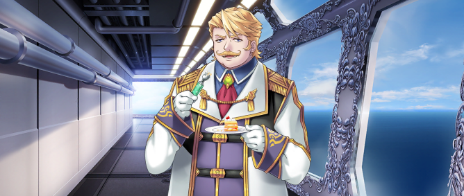
