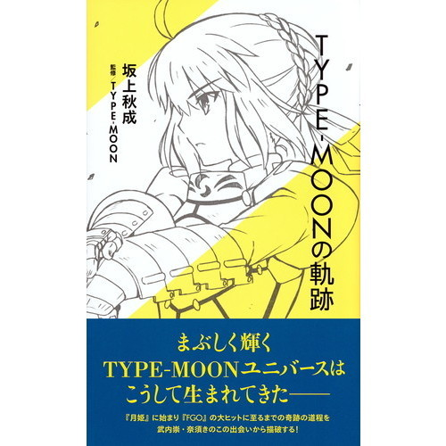

# The Trail of Type-Moon * The Biography of Type-Moon from its formation to FGO  
  
::: tip  
This booklet is summary translated by Iluna Minori. [Part 1](https://redd.it/7q2rl9), [Part 2](https://redd.it/afxdjy), [Part 3](https://redd.it/altrql)  
:::  
  
  
  
## Part 1  
  
* Nasu and Takeuchi used to be classmates, and their friendship started 30 years ago (from 2017), At that time, they were only first grade of junior high. (Page 19)  
  
* Nasu was the one who called out reaching Takeuchi because he forgot to bring his eraser. That was moments after school entrance ceremony ended. Both also ended up joining the same group (the biography didn't state what, but it was clear that their friendship started with an ~~rubber~~ eraser). Since then they started their friendship by indulging in manga and then loads of literature exchange. Takeuchi was introduced to Monthly Serial Captain, a manga magazine that was first published at 1985. This started Takeuchi's interest in drawing. (Page 19,20)  
  
*  Their biggest influence in their path to content creation however would be works of Kikuchi Hideyuki, a novelist. It is said that his impact and existence is so huge that it influenced the works they create. Such influences can be seen in their works like Tsukihime and Kara no Kyoukai.  
 (Page 20)  
  
* Nasu's very virgin work was a fanwork of ["The Screamer"](https://www.giantbomb.com/the-screamer/3030-44537/), when he completed that, he was only at his second year of junior high. His virgin work was when he started writing. What's interesting is that he did not actually play the game but instead utilize all the story settings and characters within the game, and rewrote it to form his own version of the story. (Page 21)  
  
* Fate (The original Fate, presumably Fate/Stay Night's very original concept, later repackaged as Fate/Prototype) was his third work * exact time however was unspecified, implied to written only as the early draft during his junior high days. (Page 22)  
  
* Nasu and Takeuchi went into different senior high schools after graduated from junior high, but they didn't remain separated as their home was only 5 minutes distance from each other, through bicycle. So both of them would spend their free time gather up and indulge in TRPG (Tabletop Role Playing Games) as their past time. Nasu would be the game master, and his other friends would be the players. Dungeons and Dragons would be the game of their time, but soon Nasu would create a totally different TRPG systems in order to seek for a much higher flexibility, originality and freedom. This experience cemented Nasu's path as the Scenario Writer for Type-Moon's stories. The game system he then created has a name in itself, "Tetsu no Monshou" (lit. The Iron Crest). To Nasu, it was his "Lord of the Rings" equivalent. (Page 23, 24, 25)  
  
* Takeuchi started his creator path as a mangaka during 1996, when he was 23. Dreaming about being one, he got a great head start by winning the honorable mention award in the Enix's 3rd 21st Century Manga Award competition. He also had his work published in Monthly Gan Gan Shounen WING (1997 Winter edition). Soon Takeuchi faced a dilemma in whether he'd choose to sacrifice his stable career to pursue a full mangaka route (at the time, being a Mangaka is a risky thing to do), or work a proper job (the biography didn't specifically state what). Thanks to his father and the CEO of then Ichijinsha Co.Ltd, he managed to land a job in a game company, Compile, in Hiroshima. Thus he began working full time in a game company, while drawing manga as his side. (Page 25, 26)  
  
* Nasu and Takeuchi then got separated for a while. Nasu remained in Tokyo but Takeuchi worked in Hiroshima, however it didn't last long as Takeuchi would soon reunite with Nasu after switching jobs to a different game company, Rising, which is situated in Tokyo (Page 26).   
  
* Takeuchi wanted and aimed to bring Nasu's work and make it well known to public with a serious attitude purely because he didn't want Nasu's talent gone to waste. So one random day during their usual TRPG routine with friends and halfway through, Takeuchi had a one-on-one conversion with Nasu at the second floor of their meeting place and told Nasu to not remain self-satisfied within his circle of friends and think seriously of his future and his talent. To Nasu, this shocked him because those words said by Takeuchi to him was interpreted as this: "この美しい黄金の夕焼けと比べればお前はどうなんだ (lit. What about you when compared to this beautiful golden sunset)". From there on he knew he had to go all out and start going serious since then. At the time, Mahou Tsukai no Yoru and his other work, Koori no Hana was written to be used for novel competition, but both works could not be eligible for entry due to it surpassing the limited characters allowed for a competition. **This was when both of them decided to setup Takebouki, their doujin circle before Type-Moon was established**. (Page 27, 28)   
  
The rest is history.  
  
Moving on to Fate/Grand Order (will be using "FGO" from here on)  
  
* As most of here already know, FGO did not have a smooth launch. With long term maintenance and all the screw ups plaguing the game's early stage. This was all reflected in the biography and they acknowledged all of their blunders. (Page 199, 200)   
  
* As most of here also already know, Before there was FGO, there existed an idea proposed by Type Moon where they wanted to create an MMORPG game, dubbed the "Fate online project". The plan fell apart and broke halfway but most of its settings scavenged, reimagined and used in what is presently Fate/Apocrypha. This however didn't wave away the bitterness Type-Moon had at the time.  (Page 200, 201)   
  
* The proposal to build FGO was sent out by Iwakami Atsuhiro of Aniplex, and the announcement to reboot Fate online project was during July 27, 2014. This gave both Nasu and Takeuchi "a chance of revenge". (Page 201)  
  
* However there was a problem: FGO was scheduled to be released as a smartphone game (a mobage), and this posed problems and challenges for Nasu: The difference of platforms, and more importantly, Nasu's lack of experience (he did not own smartphones prior to this project), displaying his inexperience in smartphone games. Nasu's reason behind this was due to the convenience of smartphones that will "turn him useless as a result". In order to change his mindset, Takeuchi bought him a smartphone and setup a situation which, during another usual day where Nasu goes to work as usual, he would then notice a smartphone was placed on his desk, with a number of games installed for him. The games Nasu then used to refer for the project would be "Chain Chronicles" and "Brave Frontier". Fiddling with those games made Nasu aware and he then discovered the potential of smartphone games. This realization too aligned with the vision Takeuchi wanted as well since Type-Moon wanted to catch up with the times * shifting visual novel games which is originally made for the niche market and place them into the mainstream market * a game where people can access anywhere, anytime. Additionally, the reason why Type-Moon chose to start by creating R18 game was because they felt it was "the most interesting thing likely to happen at the most interesting place", by doing so it managed to became the forefront brand recognized by most otakus. Therefore to Takeuchi, who always wanted and had been looking for his so called "interesting places": Allowing him to delve into the potential of smartphone games, which is a completely new horizon for him, was an experience worth exploring. (Page 202, 203)  
  
* After that experience, both of them, managed to link up with the Producer of FGO through another friend of theirs, which is Akihito Shouji of Delight Works to discuss what is needed to create a smartphone game. Akihito Shouji is known to have worked in Square-Enix for 15 years, and after his experience as the CEO for both Style Walker and Taito, he'd then left and established his own company, Delight Works. (Page 203, 204)  
  
* However, the launch was met with a disastrous result, and greeted with many dissatisfaction from players and fans. To prvent the game from failing further, Akihito Shouji brought in Yousuke Shiokawa , to be the current Creative Director of FGO. Yousuke Shiokawa's portfolio is very rich: having worked as a planner in Square-Enix before, with notable achievements including being involved in the production for Kingdom Hearts series and Dissidia Final Fantasy.  
  
* Yousuke Shiokawa immediately found many problems and understood how inexperienced Type Moon were in this aspect. He then pointed out the problems, especially on the UI issues and the directionless problem, and fixed it. Yousuke Shiokawa also laid out the full plan on how to "remove the weed plaguing the game", establish it's direction, and began patching the game gradually while still implementing new content. This greatly improved the game experience and gradually shaped the game into what it is today. Type-Moon is greatly appreciative of Yousuke's involvement. To them, he saved the game.  (Page 204, 205, 206)  
   
* The main keyword and the concept for FGO is "Humanity" (人理, Jinri, lit. "The Path of Humanity"). The biography then laid out the entire synopsis of Fate/Grand Order Part I itself: From the part where the Ages of Gods ended and humanity, along with the civilization flourished after. (Page 210 to 211)  
  
* The main scenario was planned and composed by Nasu, but written by Higashide and Sakurai. Three of them were initially the scenario writers of the game but halfway brought in 2 more: Hoshizora Meteo (Fire Girl, Shigatsu no Majou no Heya), and Minase Hazuki (Fate/Kaleid Prisma Ilya script writer) (Page 212)  
  
* The main story, including interludes and side events have since surpassed 200 thousand Japanese characters in total. For a smartphone game, this is considered enormous in terms of text volume. This wasn't planned that way at first. The initial idea of any smartphone game was being a light hearted, casual free to play, accessible everywhere game, and FGO was initially heading that direction, **and they didn't want to burden players with heavy story writing**, therefore they initially just aim to have the player tap a few times, get into battle, and then get back to scenario. This clashed with the idea of trying to appeal the game through storytelling because of how smartphone games are supposed to be like, and the biography pointed out that this contributed to the pacing and rhythm problems of the story. While they couldn't fix the pacing problems up to London chapter, the writing and the storytelling pacing went a drastic corrections and rewrite before the game starts to enter Chapter 5 onwards, and the story became a lot more tighter. (Page 218, 219)  
  
* The change of this direction also affected Shiokawa's decision on whether the game should put its main focus on story or not. The Dango event was the first event that made Shiokawa ponder on the decision, because at the time the game doesn't have a firm, hard decision on how the game should head into yet, so while Shiokawa was pondering to reach an answer, he always requested Nasu to write a low volume text for event stories, but he always ended up writing 5x longer than what it was requested. This shocked Shiokawa but Takeuchi had to explain to him that "This is how Type-Moon works". Due to this experience, Shiokawa decided to refocus on making the event and the game interesting through stories, pacing and text volume. (Page 219, 220, 221)  
  
* However this decision doesn't entirely bring positive results because there are also users who wished for light, less text and more reading friendly scenarios, and some events also invited complains from the players on how it became unfriendly for new users. For example: Fate/Extra CCC collaboration event that was held in May, 2017 required players to clear Part I in order to access the special event. This in turn invited some complains where they can't access the event while still going through Part I of the story. However, Shiokawa proceed and kept that direction because Shiokawa respected how how Type-Moon wanted to present their stories and the game, so a little setbacks are necessary and they are prepared to face criticisms on the matter. So even with the criticism, they chose to go with this direction because this is what they have always wanted, instead of giving in completely to users demand. (Page 221,222)   
  
* Even with the success of FGO as it is right now, their yearly and monthly sales, profit is actually not stable. It doesn't rise gradually and not every month was a profit to them. Even so, rather than making it complete business oriented, it is more about presenting what they want to present, and what they strive to. Breaking forward with their own determination yet giving users a necessary amount of care and consideration is what makes FGO successful today. (Page 222)  
  
* To Shiokawa, providing users the service that encapsulated the "life with FGO" concept is his biggest task and challenge to date. The following chapter itself also dedicated on the social aspects of the game and how it impacted the players. Touching on what Shiokawa thought of FGO as a smartphone game, to how it incorporated into the player's life, the difference between a normal consumer/console game and a smartphone game, touching on "a dual game quality" (二重のゲーム性, nijuu no geemusei) aspects as the biography labels it: as FGO is a visual novel with RPG elements as the game system, a dual game genre that mixed into one, how it affects the users response after being exposed to the game (Talking about it on Twitter, creating fanarts, etc), creating a platform of communication through the game, and the difference characterization of the game and fan works. All of these topic will turn out how the game itself influenced FGO, and the whole society's treatment of FGO's characters in turn created a strange "twist": FGO servants are originally written in the stories as "Heroic Spirits": Heroes that mainly became heroes through feats and legends left behind, and in the main story they were assigned in the roles they are supposed to play out, however, FGO being a smartphone game would mean players are exposed with the advancement of such technology and the accessibility in other social media platforms would mean we see a plenty amount of fanarts that depicted those heroes in a comedic, silly ways, a side that is more heartwarming and more humane than their supposed role in the story, turned out creating a "dual characteristics" of Type-Moon characters as a result. This also created a relationship between the players and the characters, treating as if they're a "family member" (Page 223 to 226)  
  
* The above point in turn affected how FGO is ran, in terms of how the game plans to churn out its content. For example: FGO implements game events in a much slower rate compared to other smartphone games. However, constantly running events does not however mean it will utilize the relationship between the players with their in game servants because **events and main story are, first and foremost, a very unusual daily life happening.** Therefore, in order to utilize what's been said above, and making use of the dynamic relationship between players and the characters, they needed to find something that fill in the blanks and create something to do, that doesn't give the feeling of unusual, yet a daily thing. They realize that the slow pace may cause the players who are always excited for content complain about having nothing to do (nothing that excites them). However, by constantly churning out content non stop would tire out and exhaust the relationship between the player and the character, weaken their bond with the characters as a result. **In a way, they want to create a balance where you can enjoy  the game though scenarios, or leisurely gather materials to raise your character skills, or talk about the game through social medias**, in a sense it's like how you spend your days with your family members, eat with them, and even sometimes follow them during a trip and so on. (Page 226, 227, 228)  
  
* With those 2 points above, the biography then cited 2 important aspect that put emphasis on the relationship between players and the characters: On NP skip, and Bond system. On NP skip, they cited the reason why they won't implement NP Skip feature is Noble Phantasm is part of the symbol of what makes them a Servant, the Heroic Spirit's identity. Hence it forms an important part of what "Fate" really is. Implementing the skip would decrease the value of that symbol, thus decreasing the relationship value between the characters and their players; On Bond system, the biography touched on the reason why Type-Moon and Delight Works decided to scrap the idea of "Bond Battle" quests that allows you to obtain bond points in such a short time, citing how gaining bond points in a fast period does not make you closer to the character you're raising. (Page 228, 229, 230)  
  
* As of today, Type-Moon has ~~a total of~~ approximately 15 workers. It still operates as a team instead of a full fledged corporate right now. (Page 247)  
  
## Part 2  
  
**The Establishment of Takebouki**  
  
Picking up from where that thread left off, let's see how Takebouki, the pre-cursor to Type Moon have developed since then.  
  
* After the one-on one talk between Nasu and Takeuchi, both of them decided to form their circle. The first step they took is to [create their website](http://www.remus.dti.ne.jp/~takeucto/). Note that this was 1998 or older, so you can imagine how old it is. Takeuchi was at that time very focused in one thing: to get many people to read Nasu's works, as many as they can. Their very first work published in that website that was available free to read during that time, was **Kara no Kyoukai** (abbreviated "KnK") (published October, 1998. Do note that Kara no Kyoukai was initially titled *"Kara no Kyoukaishiki (空の境界式)"* during that time). However, Takeuchi had to convince Nasu to actually post his work online and Nasu was extremely reluctant to have it published due to how it was easy for people to copy and paste the text and rehost those materials elsewhere. Not to mention, the risk of it being stolen by people plus the possibility of his works being sold without Nasu's permission can be a possibility, and to Nasu, Kara no Kyoukai was (or is) considered his greatest property (think wealth) he had, thus publishing it online for free is akin to making a risky investment that may end up disastrous if something terrible were to happen. Still, seeing the worth in Takeuchi's words, Nasu took the risk and published them in their website. Takeuchi's main direction for how Kara no Kyoukai was to have Nasu write the work in one entire series, but separate them into several chapters and publish them one by one. However, due to how Nasu's habit of always delivering story volumes beyond what was planned, KnK took a while to finish its run, and was published for quite a long while (or at least longer than what was planned). (Page 28, 29)  
  
* Takeuchi underestimated Nasu's capability at that time as he envisioned Nasu would write short, light and easily digestible works for first time readers exposed to his works as a start, and hoping the readers can easily get into it. However with the submission Nasu made for Chapter I "Overlooking View" *[Fukan Fūkei (俯瞰風景 Thanatos.)]*, the text volume was easily 10 times larger than what Takeuchi had envisioned, and the subsequent chapters got even longer than Chapter I. According to the biography, The total pages for Chapter I in Kodansha Novel's 2004 edition of Kara no Kyoukai spanned 43 pages, while Chapter V, Paradox Spiral *[Mujun Rasen (矛盾螺旋 Paradox Paradigm.)]* is easily 6 times the volume of Chapter I, spanning 267 pages. While this may seem nothing to English viewers but consider this: Japanese novels are formatted for the readers to read it from right to left, and texts are aligned vertically (up to down) instead of the eastern left to right. So even with taking spacing and design into consideration, a page itself already contained approximately 414 Japanese characters. So with some simple mathematics, Chapter V itself has an approximated total of 221,076 Japanese characters (according to the biography: 23 characters vertically x 18 characters horizontally x 2 (pages, left and right) x 267 total pages)[1]. (Page 29)  
  
* Even with such volume he had to write during that time, Nasu's pace never once slow down. In fact all chapters were written, delivered, and published online right on schedule. During the writing, Nasu only had at most 4 hours of writing time allocated for him as the remaining time was used to work (as he had a proper job that time), eat and sleep. This however didn't affect Nasu at all, but it did create situations where Nasu was highly frustrated because he wanted to keep writing but couldn't due to work. So when he reached home after that, he'd get so immersed into writing Kara no Kyoukai that he'd often get into fantasy mode (and he was in total bliss when he did so) and wrote those fantasies into shape. Thanks to that, the limited time in return sent Nasu into complete focused mode, and the result was a complete Kara no Kyoukai [2]. (Page 30)  
  
* Although Nasu's attitude and perception on internet were mostly doubts and uncertainty, it wasn't all rains and storms. During its run, OKSG (pronounced Okashige) came across KnK online and sent his opinions to Nasu. OKSG thus became one of Type-Moon's earliest members, dealing with Type-Moon's official webpage and mobie side of things. This actually had an impact as more and more readers came across Nasu's works online, their opinions and fan messages sent to Nasu gave him a huge boost in confidence; And even though internet has its risks, with how interaction and feedback between users and Nasu's works became easier for Nasu to ascertain, his doubts and distrust towards internet mellowed down and soon died off. (Page 30, 31)  
  
* Even though Kara no Kyoukai was received well by readers who came across it, it wasn't entirely sunshine and rainbows either. Takeuchi and Nasu then attempted to use the chance to print the novel into a physical copy and attended [Comitia](https://www.comitia.co.jp/) (Think Comic Market, but entirely for non derivative, completely original works only), hoping to spread Nasu's works and reputation further. Sadly, **among 20 copies printed, only 6 were sold**. While this may seem nothing to most, it was a huge discouragement to both Nasu and Takeuchi. The biography thus wrote that failure as this: "A piece of work that should easily convey how interesting and amazing it is once you read it. Yet, not many would come their way to grab a copy and read it." (Page 31)  
  
* Though discouraged, that didn't stop Nasu and Takeuchi. "If there are potential readers out there that may read and think it's interesting yet couldn't find them due to the lack of exposure or availability, then find a place where people can easily reach such work so that it can propagate. If this book can't sell (through this place), then find another stage where we can sell them off easily." With that in mind, they held a hope, and a faith * they believed firmly that there's definitely someone, or a group of people who understands their work and will find Nasu and Takeuchi's work interesting. Yet they need to find some way to approach those people and spread their works, but in entirely different format, through a platform that is radically different but has the potential to spread far and wide. Without hesitation they tried wandering around and found their next destination: The world of Doujin Games [3].  (Page 32)  
  
* Doujin games before Type-Moon were already popular and received a huge boom thanks to adult novel games like [Shizuku (1996)](https://en.wikipedia.org/wiki/Shizuku), [Kizuato (1996)](https://en.wikipedia.org/wiki/Kizuato), and mainly, [To Heart (1997)](https://en.wikipedia.org/wiki/To_Heart) which all of them are released by Leaf. Both Takeuchi and Nasu did their research and, with Leaf as a goal, they decided to make a breakthrough through adult novel doujin games. But unlike a full fledged novel, entering the world of doujin game is another playing field altogether. (Page 33)  
  
* To begin with, Novel games (an overall general term defined by the Japanese. Visual novels, galge and eroge are all considered as a form of novel games) are games that utilize novel as the main form of storytelling but also include visuals, sound, and acting. So Nasu and Takuechi were aware that they couldn't create a novel game with a large amount of text like how they did with Kara no Kyoukai because they'll risk putting off people through a gigantic amount of text. However they also realize that their advantage lies in the ability to incorporate visuals and music and not to mention the ability to include x-rated elements which can easily capture readers rather than just using pure text. But above all, what is more important to them is that: the novel game industry of the past, be it commercialized or indie was still experiencing its golden age thanks to the huge boom. This means **absolute creative freedom** in being able to do whatever they want with it. Considering how free it was and how there were no particular rules to adhere in that industry, this to them meant "as long as it's interesting, anything goes". So in the case of novel games,  creating stories with the mindset of "anything goes as long as it's erotic and arousing when creating a romance porno story" is considered acceptable and the industry was very tolerant to have that included, and similarly so was the mindset of including unethical elements like sex and violence in a novel game. *This actually presented a very good opportunity for Nasu as this type of freedom is actually compatible with his writing ability.* (Page 34)  
  
* So in order to prepare themselves for a novel game they will be making, they needed a circle name made specifically for the novel game. Nasu did some look around and picked Type Moon, the character that was created for Nasu's TRPG "Land of Steel", citing "I want a circle name that is associated with a moon". Takeuchi thought the same and thus both of them agreed. **Thus their next circle, "Type-Moon" is formed**. (Page 34)  
  
* Their project would thus comprised of Nasu being the scenario writer, Takeuchi as the graphic artist. Needless to say they needed more people as programmers, and composers are vital to the project as well. Luckily Takeuchi has connections and managed to recruit Kiyobee (the programmer) and KATE (the composer). Both Kiyobee and KATE were once Takeuchi's co-workers from Hiroshima (refer to Part I of the thread for details). With that, the earliest members of TYPE-MOON, is formed. (Page 35)  
  
(TO BE CONTINUED)  
  
---  
  
[1] Don't blame me if the math doesn't add up, bring it to the author Shuusei Sakagami, the person who wrote this biography.    
  
[2]  If you wanna meme about how he should enter that mode in order to finish Tsukihime Remake, just remember this: He still manage to deliver a lot including FGO (since it's confirmed that Nasu writes the starting and ending segment of each Lostbelt chapters, and in addition to that, other Fate stories like Extra, Mahou Tsukai no Yoru and many more) so no it's not like he slacked hard and forgot Tsukihime Remake completely. So my point is, when it's time for Tsukihime Remake to be ready and released, it will be released. So wait, and hope. Considering the status of Nasu during Kara no Kyoukai compared to now (which he's even busier than he was before), I'd say just let him do whatever he wants ^(yeah, nothing new anyway *grumblegrumbleMahoutsukainoyorudelaygoddamnyounasugrumble*).    
  
Although, sure, we can always pull a Koha Ace and egg on Nasu to hurry up with Tsukihime Remake, nothing wrong with that.    
  
[3] While Doujin Games can be mostly erotic due to how easy it is to create exposure, the core nature of a doujin game is not that much different from your indie game. Therefore the context is more towards indie game development instead of your typical definition of a doujin game.  
  
Next, PART III will delve deeper in the production of Tsukihime, up to Fate/Stay Night.  
  
## Part 3  
  
* The very first meeting to discuss the creation of Tsukihime began on year 1999, Summer. At that time, there is only one thing Takeuchi had in mind: "What should we do in order to have people look at our work." (Page 38)  
  
* Due to that, they have decided to tackle on the doujin genre and include X-rated elements for their next work. Takeuchi then add in one more further thought in it: How do we make people pay attention to Nasu's unique way of writing, his story, his world and his lore. As said in the [previous thread](https://www.reddit.com/r/grandorder/comments/afxdjy/the_trail_of_typemoon_how_did_takebouki/), while sure there will face some problems trying to portray Nasu's unique world to the audience mainly through using words and description using the genre of doujin or internet, but at the same time, people who have exposed to his works have already acceptable those as Nasu's unique way (and his style) of writing and deliver his complex world building with his story in a poetic manner. Takeuchi is especially fearful of that point because Type-Moon at that point have decided and wanted Tsukihime to be friendly enough as an entry point to Nasu's works, and thus feared that Nasu's habit may cause a backfire. The biography then cited one part an interview from Tsukihime Dokuhon -PLUS PERIOD* book that touches on his perspective about "Lines of Death" as an example[1] of how important it is to portray such concept in an "easy to understand" manner, yet emphasis on what makes the concept "so catching", or "attractive". So Takeuchi as the producer of Tsukihime would give his opinion on Nasu's unique worldview and lore but took extra care not to breakdown Nasu's original intention and idea, ensuring that the concept, idea and story of Tsukihime is attractive enough to capture readers, and that was the image they had before starting production. (Page 39, 40)  
  
* For Tsukihime, Takeuchi gave Nasu two objectives: 1. Redefine and give shape to the idea and concept of vampires and serial killers that Nasu had since his junior high days; and 2. Use the concept of "Mystic Eyes of Death Perception" used in Kara no Kyoukai and put it into Tsukihime. Nasu was rather reluctant and hesitant in doing so at first, but Takeuchi managed to push this, stressing on how attractive that concept is and how it has the potential to catch the reader's attention. This would thus led to Shiki Tohno, the main protagonist of Tsukihime, having the power of such Mystic Eyes. (Page 41)  
  
* Even so, there is one more hurdle that they need to get past: How will they treat the whole X-rated elements and inject "romance elements" into Tsukihime. Initially, Takeuchi proposed to make a game similar to "To Heart", which they see it as "a game where players get to enjoy seeing the protagonist fall in love with the heroine and initiate communications with them". However Nasu wanted to avoid writing stories to include elements that he enjoyed as a player. Meaning he wants to write story from the perspective of a writer, not as a player that enjoyed one game and import such influences into his story. Nasu also made sure that the protagonist existence is created to be someone who is "a person who has problems to bear" as the premise. To Nasu, the protagonist should be none other but act as the reader's other self, therefore he doesn't just want the heroine to just be the protagonist's date partner but also want the protagonist to simply be active by being the center of his stories, the world and take part in them. Nasu then told Takeuchi that he would want Tsukihime to be something like ["ONE: Kagayaku Kisetsu e"](https://es.wikipedia.org/wiki/One:_Kagayaku_Kisetsu_e) and they soon reach a compromise due to how ONE and To Heart are both very similar at the core concept. The biography also explains the reason behind Nasu specifically point out ONE is due to its greater emphasis in story than To Heart, and how the protagonist's image expression is much closer to novel level expression. Thanks to that Nasu got that influence and thought that if such method of expression is possible, then it is definitely doable for him to write out a love story of that level. (Page 41, 42)  
  
* It is then after everything has been decided and settled that Tsukihime started its production: Nasu would then be the sole scenario writer, and Takeuchi the character designer,  in game frames, and coloring. (Page 43)  
  
* Things weren't sailing smoothly for them at first. On Takeuchi's side, he could not spend entire time working on it due to having a full time job he need to prioritize. He lived an everyday life where he would go work during the day, and he'd continue working on them during night after work, therefore he could not work the whole day on Tsukihime until he quit his full time job halfway the production of Tsukihime. He had to stay up and work till to 3 am in the morning, sleep, wake up and go straight to work every day. Furthermore he also used his lunch break to cycle back to his place and work a little on Tsukihime since his workplace was only 5 minutes from his home; and once lunch break is up, he'd then cycle back to his company to continue working. Due to the agreement during the planning that they'd first focus on "quantity rather than quality", he had to work on roughly 240 different standing character poses with different expressions (each with details Takeuchi paid with attention and care), and in a year he had to finish drawing 400 illustrations in total, which the 240 character poses were accounted for. In a way, he had to finish one (or sometimes above one) in game frame a day, and it was done from nothing to completion.  
  
* On the other hand, Nasu never had it easier either. after Kara no Kyoukai finished its run, he quit his previous job in order to obtain the time to write Tsukihime, but at the same time also landed a part time job in a game company to financially support himself. His workplace was not kind to him, as being a rookie means he had to work on menial tasks. Worse, it could take him up to almost 20 hours per day and thanks to that, the production experienced a temporary halt after the the completion of main heroine's route [2]. Takeuchi, seeing how he wanted their work to be fully completed plus how he refuse to sacrifice their dream and passion, along with wasting Nasu's talent along, told Nasu this: *"You do not worry about your financial issues. I'll support your lifestyle from then on, so please focus yourself and finish Tsukihime"*. Takeuchi then proceed to go break his savings and used his hard earned money to support Nasu's daily life, while knowing full well that Tsukihime was just at most, a doujin game, and the risk of it being a failure plus not selling well will mean all the money spent will be all for nothing, and the mental damage will be enormous. But their passion and determination, plus the experiences of how all members of Type-Moon having a blast throughout the entire production period, proved to be the ultimate winner in the end as Nasu managed to deliver 5,000 pages (manuscript paper level) worth of scenario volume in a year, finally completed Tsukihime. (Page 44, 45, 46)    
  
* Tsukihime was supposedly scheduled to be released on August 11, 2000. But this being the first game Type-Moon worked on, they couldn't finish it due to not being able to complete programming and debugging of the entire game in time, they only managed to released the first, semi-demo version of Tsukihime, which is titled [Tsukihime ~Hangetsuban~ (Tsukihime: Half Moon Edition)](https://twitter.com/surugaya_st/status/1081078697036148737) [3]. This copy of the game included only Arcueid and Ciel's route, and was released at Comiket 58. They managed to produced **only 300** copies in total, but sold them all out and generated extremely positive response. This too was thanks to the [floppy disk demo](https://pbs.twimg.com/media/DVRt7H6UQAATQ6y.jpg) that they managed to distributed prior to the Half Moon edition, which allow people to be interested in their works. Later in Comiket 59 (December 29, 2000), Type-Moon released the full version of Tsukihime (titled Tsukihime ~Kanzenban~). Although Nasu and Takeuchi wanted to take it easy and managed to produced 800 copies, it was sold out almost immediately and became a huge hit, generating many discussions in online forums and praised by many as masterpiece. Months later, Type-Moon attended Sunshine Creation 10, a smaller scale convention and released Tsukihime PLUS-DISC [4], an "expansion" Tsukihime content that included "Alliance of Illusionary Eyes" and "Gekocha".  Type-Moon continued expanding Tsukihime further by releasing "Kagetsu Tohya" in Comiket 60 (August 10, 2001), A Tsukihime fan disc (think Hollow Atraxia) where it acts as a sequel to Tsukihime. Prior to the release is where Koyama Hirokazu ^(Character Designer of Scathach, Medea Lily, Scathach=Skadi, Summer Scathach, Musashi, Romulus) joined Type-Moon as the colorist and Kagetsu Tohya was his first work he participated in.  (Page 62, 63)  
  
*  Soon after Type-Moon would proceed to expand Tsukihime beyond the visual novel format and released Melty Blood, a doujin fighting game series based on Tsukihime characters developed by Type-Moon and Watanabe Seisakujo (now known as "French Bread"), released on 28th December, 2002 (Comiket 63). Melty Blood series soon became popular and seen expanded and ported into home console (Melty Blood Act Cadenza and Melty Blood Actress Again, Playstation 2) and Arcade. Other media expansion also saw Tsukihime also got adapted into TV anime by J.C.Staff[5] and also in manga form by Sasaki Shonen in 2003, serialized in "Gekkan Comic Dengeki Daioh". (Page 64)  
  
* Finally, Type-Moon released their final Tsukihime product, "[Tsukibako](https://i.imgur.com/y6sMEoN.jpg)" * the definitive, complete set of Tsukihime that includes Tsukihime, an expanded version of PLUS-DISC called the "PLUS+DISC", Kagetsu Tohya, a remixed soundtrack, a trial version of Melty Blood, and other assorted multimedia. This was released in April 29, 2003 in Comic Revolution 33, another convention. The release of Tsukibako is the last time TYPE-MOON exists as a doujin circle, and soon after they ceased their doujin activity completely and thus Type-Moon as a doujin circle no longer exists[6]. Soon the members of Type-Moon moved on to form Notes Co., Ltd., and re-established "Type-Moon", subsequently bringing their indie status into a full fledged commercial status where they proceed to create the series we now know today as "**Fate/stay night**".  (Page 64)  
  
* Type-Moon, through Takeuchi and Nasu's definition, was a circle formed specifically to bring Tsukihime from underground to the world. Initially Nasu and Takeuchi meant to pursue their dream jobs after the production of Tsukihime ended: Nasu aimed to become a full-fledged novelist while Takeuchi would pursue the path to become a full-fledged mangaka instead. However due to the tremendous response garnered from releasing Tsukihime, both soon faced a crossroad, with 2 choices available to them: To continue what they have achieved and further work together to create something else, or split up and pursue their dream jobs separately. (Page 65)  
  
* It was year 2002. But to begin this story, we need to understand firsthand that Nasu have always liked reading Mystery genre novels, citing Yukito Ayatsuji, Kiyoji Kasai, Natsuhiko Kyougoku, Souji Shimada, and Kenji Takemoto as his favorite Mystery novelists and have always read their books. Since all the authors came from Kodansha Novels label. Nasu became fascinated and always have aimed to become a novelist associated with Kodansha. But among all, what drastically changed his view would be the novel "The Beheading Cycle: The Blue Savant and the Nonsense Bearer (クビキリサイクル 青色サヴァンと戯言遣い Kubikiri Saikuru: Aoiro Savan to Zaregoto Tsukai)" by Nisio Isin due to how unique the novel cover is and how Nisio Isin brought his way of portraying characters in a "pop-ish" way and more importantly, hammered out the characteristics of his characters fully. This, when Nasu read the novel, was exactly what Nasu would attempt to write if he were to pursue his dream to become a novelist for Kodansha. From there he decided that there was no need for him to become engrossed at the thought of becoming the novelist for Kodansha, and more importantly, to answer his fans' expectations towards him, decided to continue working on visual novels. Takeuchi agreed with the approach he took, and thus they've decided to bring Type Moon onto the next stage. Nasu would then continue to contribute stories like "DDD"[7], "Tsuki no Sango", "3/16 Incident" (written together with Shunji Enomoto) and so on. This in essence fulfilled what Nasu wanted to achieve since he was young and his dream already came true. Therefore he decided to move on and focus entirely in being a game scenario writer, mainly on visual novels. (Page 66, 67)  
    
---  
  
This covers the biography section on Tsukihime. And next in Part IV * Fate/stay night, and Fate/Zero.  
  
**Notes**  
  
[1] Nasu's statement in Japanese:  
  
"わかりにくいところ、たとえば「死の線」にしてみても「生物が内包する寿命が云々」と言われてもよくわからなかったんで(笑)。(…）「壊れやすい線」だけでいい。そこをなぞったら壊れる、ってだけでいい。という風にして「わかりやすさ」を強調してもらいました。" (Statement taken from "Tsukihime Dokuhon Plus Period")  
  
Translation:    
"...Though this sounds hard, for example even if (you are to) look at the "Lines of Death" and being told it's "a life span that involve all living beings" you wouldn't even understand that well enough (lol). (omitted) so instead I emphasized on making it "easy to understand" by just making it "lines that can be destroyed", or "if you just trace that, it will crumble"."  
  
(Anyone feel free to pinpoint this translation in case of any mistakes made because I don't have the full context from the interview to make out the full meaning. Hopefully this is close enough.)    
  
[2] Tsukihime's production was halted halfway after Arcueid and Ciel's route was completed. The biography did not mention if this was the reason why Tsukihime was released as a Half Moon edition as well, only cited programming and debugging problems as the reason.  
  
[3] Tsukihime: Half Moon Edition and the Floppy Disk demo edition is by far the rarest item ever among all Type-Moon items available. Suruga-ya, one of the merchandise shop specializes in selling second hand and auction goods is offering [75,000yen (689.10 USD) to those who are willing to sell their copy](https://www.suruga-ya.jp/kaitori_detail/186057972). And Yahoo Auction is listing them for 500,000yen (4,954.90 USD) if you are willing to fork that much to purchase the **[entire original Tsukihime game set released by Type-Moon in Comiket so far](https://page.auctions.yahoo.co.jp/jp/auction/e296069761)**.     
  
[4] One interesting thing to note is that The Tsukibako edition later changed the PLUS-DISC name to PLUS+DISC.  
  
[5] Yes I know, I'm highly aware of the meme. Just accept that it existed and label it as a failure if you so wish, ^(or the anime doesn't exist at all...yeah).  
  
[6] While Type-Moon as a doujin circle no longer exists after May 2003, the circle "Takebouki" still lingered as the circle made its appearance 5 years later and released "Kara no Kyoukai the Garden of sinners/recalled out summer". That was the final appearance of the circle Takebouki in any Japan conventions. The final appearance of Takeuchi's participation in doujin however was year 2009, which he released a doujin illustration book titled "Haru to Tsuki to Sora to" under the circle "Rubicon Hearts" with Jin Kobayashi, the mangaka of School Rumble.   
  
[7] Decoration Disorder Disconnection. While most western Type-Moon fans often went "Tsukihime Remake when?", "DDD Vol.3 when?" is more prominent on the Japanese side.   
  
  
  
  